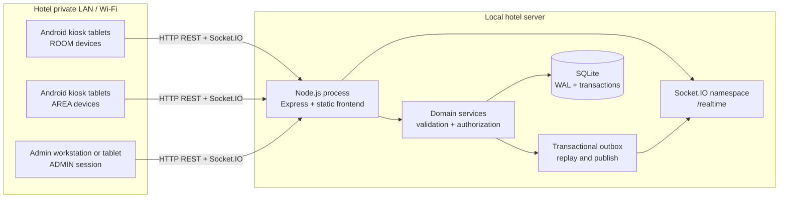
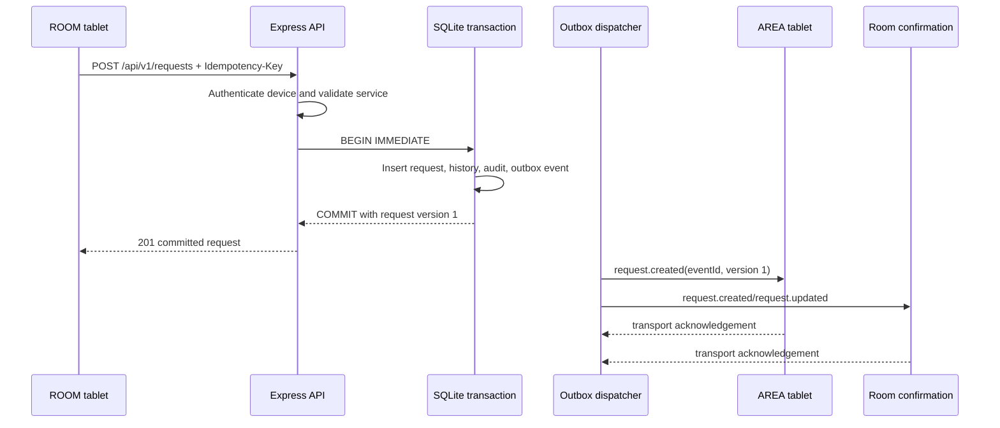
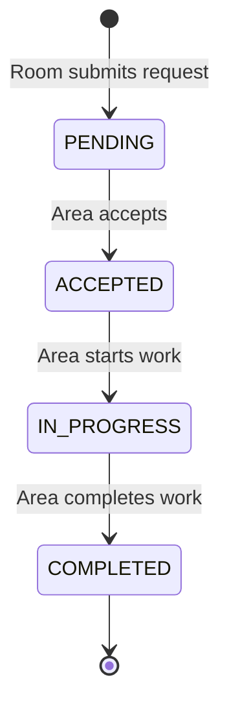

# Hotel Local App — Technical Product Requirements Document

**Document status:** Implementation-ready baseline  
**Version:** 1.1.0  
**Audience:** Coding agents, developers, QA, hotel operations, and deployment technicians  
**Scope:** Local/LAN hotel request and operations application  
**Runtime language:** English for code, identifiers, technical artifacts, and default UI copy

## Table of Contents

1. [Executive Summary](#1-executive-summary)
1.1 [Implementation Decisions v1.1](#11-implementation-decisions-v11)
2. [Product Definition](#2-product-definition)
3. [Goals, Non-Goals, and Assumptions](#3-goals-non-goals-and-assumptions)
4. [Users and Personas](#4-users-and-personas)
5. [Product Rules and Decisions](#5-product-rules-and-decisions)
6. [Functional Requirements](#6-functional-requirements)
7. [Architecture](#7-architecture)
8. [Domain Model and SQLite Schema](#8-domain-model-and-sqlite-schema)
9. [REST API](#9-rest-api)
10. [Socket.IO Realtime Contract](#10-socketio-realtime-contract)
11. [Request State Machine and Concurrency](#11-request-state-machine-and-concurrency)
12. [Complete Operational Flows](#12-complete-operational-flows)
13. [UX and Screen Requirements](#13-ux-and-screen-requirements)
14. [Security Model](#14-security-model)
15. [Device Identity and Android Kiosk Strategy](#15-device-identity-and-android-kiosk-strategy)
16. [Resilience, Recovery, and Observability](#16-resilience-recovery-and-observability)
17. [Non-Functional Requirements](#17-non-functional-requirements)
18. [Repository Structure](#18-repository-structure)
19. [Configuration and Environment](#19-configuration-and-environment)
20. [Migrations, Seeding, Backups, and Operations](#20-migrations-seeding-backups-and-operations)
21. [Testing Strategy and Matrix](#21-testing-strategy-and-matrix)
22. [Phased Implementation Plan](#22-phased-implementation-plan)
23. [Acceptance Criteria](#23-acceptance-criteria)
24. [Definition of Done](#24-definition-of-done)
25. [Implementation Notes and Trade-offs](#25-implementation-notes-and-trade-offs)

---

## 1. Executive Summary

Hotel Local App is a single local web application served from a computer or small server on the hotel's private LAN. Guests use dedicated Android tablets configured as **ROOM** devices to request services. Operational staff use **AREA** tablets to receive and process those requests. Administrators use a protected **ADMIN** mode to configure the hotel's rooms, areas, services, devices, requests, and system behavior.

The product is deliberately self-hosted and small:

```text
React + Vite + TypeScript + Tailwind CSS v4
                    |
             HTTP REST + Socket.IO
                    |
        Node.js + Express + Socket.IO
                    |
                  SQLite
```

SQLite is the source of truth. REST mutations execute transactional writes to SQLite. Socket.IO transports committed events and helps clients update immediately, but it is never the authority for business state. A client must be able to reconnect, query current state, and recover without a manual browser refresh after Wi-Fi loss, socket loss, browser restart, or server restart.

The system targets reliable unattended operation on a small hotel LAN. It does **not** promise literal 100% availability: hardware failure, power loss, damaged Wi-Fi, or a destroyed server remain possible. It does promise bounded recovery behavior and clear operational visibility into device health.

---

## 1.1 Implementation Decisions v1.1

This section is authoritative wherever earlier wording differs. These decisions close the implementation ambiguities identified during review.

### 1. Realtime cursor and coherent snapshot

- `eventSequence` is the only replay cursor: a monotonically increasing integer equal to `outbox_events.id`.
- `eventId` is an opaque UUID/ULID for tracing and deduplication only; it is never a cursor and must not be sorted or compared for ordering.
- `configurationRevision` is the global configuration version. `deviceConfigVersion` is the version of one device's assignment/runtime configuration. Neither is a replay cursor.
- Presence/heartbeat and protocol events do not consume business `eventSequence` values.

Canonical client and snapshot contracts:

```ts
export interface LocalDeviceIdentity {
  installationId: string;
  deviceId: string | null;
  deviceToken: string | null;
  lastSeenEventSequence: number;
  configurationRevision: number;
  deviceConfigVersion: number;
  soundEnabled: boolean;
}

export interface DeviceSyncSnapshot {
  snapshotSequence: number;
  currentEventSequence: number;
  configurationRevision: number;
  deviceConfigVersion: number;
  serverTime: string;
  device: DeviceDTO;
  config: DeviceConfig;
  activeRequests: RequestDTO[];
  pendingTokenRotation: {
    rotationId: string;
    state: "ROTATION_PENDING" | "CLAIMED";
    graceExpiresAt: string;
  } | null;
}
```

The server creates a snapshot in one consistent read transaction: `BEGIN`, capture `COALESCE(MAX(outbox_events.id), 0)` as `snapshotSequence`, read the device configuration, catalog, and active requests from that same transaction, then commit and return the snapshot. Mutations committed while the snapshot is being generated are not partially visible. Their sequences are greater than `snapshotSequence` and are replayed after the snapshot, or a subsequent sync covers them. The client atomically replaces state, sets its cursor to `snapshotSequence`, and applies only events with larger `eventSequence` values.

Reconnect/replay rules:

1. The client sends `lastSeenEventSequence` and `deviceConfigVersion` in the handshake/sync request.
2. Equal current sequence returns `UP_TO_DATE`.
3. If all sequences after the cursor are retained, the server replays applicable durable events in ascending `eventSequence` and returns `SYNC_COMPLETE` with `currentEventSequence`.
4. A missing, invalid, too-old, or device-mismatched cursor returns `FULL_SNAPSHOT_REQUIRED`; the client fetches `DeviceSyncSnapshot`.
5. A device configuration version mismatch always requires the current device snapshot.
6. The client shows `ONLINE` only after replay or snapshot application succeeds. Events arriving during snapshot generation are never discarded.

### 2. Device token lifecycle

A raw token is returned exactly once through an authenticated protected JSON response. It is never placed in URLs, logs, events, audit metadata, screenshots, or error messages. The server stores only a hash and non-sensitive prefix.

Normal remote rotation is a pending/grace-period flow:

1. `POST /api/v1/devices/:deviceId/token-rotation` creates `ROTATION_PENDING` and emits `device.token.rotation.required` without a raw token. No replacement secret is generated or persisted at this point.
2. The old token remains valid during the bounded grace period. The rotation records the current token ID, and the device claims using the old token at `POST /api/v1/device/token-rotation/claim` with `{ "rotationId": "rot_01" }`.
3. During the authenticated claim transaction, the server generates the replacement secret, stores only its hash in the pending rotation row, marks the rotation `CLAIMED`, and returns the raw replacement token once in the protected response. The device stores it and calls `POST /api/v1/device/token-rotation/acknowledge` with the new token and rotation ID.
4. Acknowledgement atomically inserts the new active token and revokes the old token. Claim and acknowledgement are idempotent for that rotation; an unclaimed rotation expires without silently issuing a token.

During `CLAIMED`, the replacement hash is accepted only by the acknowledge endpoint; it is not yet a general runtime credential. If the claim response is lost, the old token remains usable and an administrator must cancel/expire that rotation and start a new one. The server never reconstructs or returns the lost raw token. If the acknowledgement response is lost, repeating acknowledgement with the replacement token is safe and returns the already committed result.

```json
POST /api/v1/devices/dev_01/token-rotation
{ "gracePeriodMinutes": 30, "reason": "Scheduled credential rotation" }

200
{ "data": { "rotationId": "rot_01", "state": "ROTATION_PENDING", "graceExpiresAt": "2026-08-31T12:30:00.000Z" } }

POST /api/v1/device/token-rotation/claim
{ "rotationId": "rot_01" }

200
{ "data": { "rotationId": "rot_01", "deviceToken": "raw-token-visible-once", "tokenPrefix": "htl_9a2b" } }
```

Offline/replacement rules:

- Offline rotation remains `ROTATION_PENDING`; the old token remains valid until grace expiry unless compromise is suspected. On reconnect the device claims, stores, acknowledges, and reconnects with the new token.
- Emergency compromise revocation immediately revokes the old token and invalidates active sockets; protected local rebind/admin-assisted bootstrap is required.
- Physical replacement gets a new `installationId`; the admin revokes the old device/token, records the replacement, and bootstraps the replacement.
- Lost browser storage enters protected rebind. An installation ID alone never proves trust.
- Remote reassignment increments `deviceConfigVersion` and global `configurationRevision`; token rotation is required when crossing a trust boundary or explicitly requested.

### 3. Cross-table SQLite invariants

Structural invariants use SQLite `FOREIGN KEY`, `CHECK`, `UNIQUE`, and partial indexes. Cross-table active-state/domain rules use a domain service inside `BEGIN IMMEDIATE`. Triggers are defense-in-depth only when approved direct SQL writers exist; they do not replace domain validation.

Required rules:

- Active services require active areas.
- Active devices require an active room or area matching their assignment mode.
- Requests require active room, service, and service area; creation snapshots route/display data.
- An area cannot be deactivated while it has active services, assigned active devices, or open requests (`PENDING`, `ACCEPTED`, `IN_PROGRESS`) unless an explicit atomic reassignment/closure workflow resolves every dependency.
- A room cannot be deactivated while it has an assigned active ROOM device or open requests without an explicit reassignment/closure decision.
- Service reassignment/deactivation cannot alter existing request routing.
- Dependent rows are validated before any write, leaving no orphaned active work.

Every rule requires domain-service tests, real SQLite migration/integration tests, and trigger tests when direct SQL writers are supported.

### 4. Admin lifecycle and actor attribution

The MVP first administrator is created only by local `pnpm admin:create` with an interactive password prompt or secure environment input. There is no unauthenticated web first-admin route and no default production password.

```text
GET    /api/v1/admins
POST   /api/v1/admins
GET    /api/v1/admins/:id
PATCH  /api/v1/admins/:id
POST   /api/v1/admins/:id/activate
POST   /api/v1/admins/:id/deactivate
POST   /api/v1/admins/:id/password
POST   /api/v1/admins/:id/revoke-sessions
POST   /api/v1/auth/admin/change-password
POST   /api/v1/auth/admin/logout-all
```

The last active admin cannot be disabled. Password changes revoke that admin's sessions; `logout-all` revokes all sessions for the current admin. All lifecycle operations are audited.

`request_status_history` is authoritative for transition actors through `actor_type = ADMIN | DEVICE | SYSTEM` and `actor_id`. The request row keeps only coherent creation attribution (`created_by_actor_type`, `created_by_actor_id`) as a denormalized convenience matching the creation history row. `accepted_by_device_id`, `in_progress_by_device_id`, and `completed_by_device_id` are removed from the baseline schema; existing deployments may retain them as deprecated read-only compatibility fields but must not use them as authority.

### 5. REST and authentication decisions

Every path is absolute `/api/v1/...`. Exact headers are:

```http
Authorization: Bearer <device-token>
Idempotency-Key: <1-128 character opaque key>
X-CSRF-Token: <token returned at admin login>
```

| Caller | Credential | Scope | CSRF |
|---|---|---|---|
| ROOM/AREA device | `Authorization: Bearer` device token only | Assigned room/area runtime operations | No cookie; bearer required |
| ADMIN browser | HTTP-only same-site session cookie plus CSRF header on mutations | Admin resources and authorized request operations | Required on every state change |
| SYSTEM process | Local process identity | Migrations, outbox, retention, backup | Not applicable |

Mixed credentials are rejected with `AUTH_AMBIGUOUS_CREDENTIALS`; device routes never fall back to admin cookies and admin routes never fall back to device tokens. The device snapshot is `DeviceSyncSnapshot` and `GET /api/v1/device/session` returns it. A revoked token returns `401 DEVICE_TOKEN_REVOKED`, an inactive device `403 DEVICE_INACTIVE`, and an unreadable database `503 DATABASE_UNAVAILABLE`.

### 6. Workspace reproducibility

The repository must include `packages/shared/package.json`, committed `pnpm-lock.yaml`, and `.nvmrc` or `.tool-versions`. Root `package.json` pins `packageManager` and supported Node.js in `engines`. Exact dependency versions live in manifests and the lockfile; agents must never infer or install “latest”. MVP default SQLite driver is `better-sqlite3` unless a documented benchmark/compatibility decision changes it. Vite proxies `/api` and `/socket.io` to Node during development. Scripts use `pnpm --parallel` or pinned `concurrently`, never shell-specific `&`.

### 7. HTTP risk and incident response

HTTP remains valid because HTTPS and PWA are not runtime requirements. Production HTTP requires signed risk acceptance and a private/segmented LAN or VLAN, strong Wi-Fi authentication, firewalling, restricted admin network, physical server/tablet control, and no Internet dependency. Optional HTTPS hardening is recommended but not an MVP prerequisite. CSRF protects cookie-authenticated browser intent; it does not protect credentials or bearer tokens from an on-path HTTP attacker.

If interception is suspected: isolate the affected segment; revoke suspected device tokens, admin sessions, and active sockets; rotate `SESSION_SECRET` and `TOKEN_PEPPER` as appropriate; change affected admin passwords; reissue tokens through protected rebind/rotation; inspect audit logs; and restore service only after controls and credentials are revalidated. Changing `TOKEN_PEPPER` invalidates existing device-token verification and requires reissuing all device tokens.

### 8. Event classes and replay retention

| Event class | Examples | Persistence/cursor |
|---|---|---|
| Durable business/configuration/security | `request.created`, `request.updated`, `device.config.changed`, `device.token.rotation.required`, `service.catalog.changed` | Transactional outbox; ordered by `eventSequence` |
| Ephemeral presence/heartbeat | online/stale/offline and heartbeat | Latest state plus bounded history; best effort; no replay cursor |
| Protocol | `connection.ready`, `sync.required`, acknowledgements | Not business-persisted; no business sequence |

Unpublished outbox events are never pruned. Published durable events are retained until both minimum floors are satisfied: they are at least 60 minutes old and the retained set is at least 100,000 events deep. This produces an effective replay window of at least 60 minutes and at least 100,000 events; configurable age/count values may not be set below either floor. A 10,000-event window covers only about 8 minutes 20 seconds at 20 mutations/second and is not the production default. A cursor outside the window forces a full snapshot. The 72-hour idempotency retention is separate and protects mutation retries, not realtime replay.

### 9. Completeness decisions

- `system_settings` uses a type-safe catalog of keys, JSON value shapes, defaults, bounds, and mutability; unknown or invalid values are rejected.
- Default maximum lengths/rate limits are documented in Sections 9.1 and 14.5.
- Offline queue TTL is 48 hours by default, shorter than 72-hour idempotency retention. Expired entries become `EXPIRED_UNSENT`, are not automatically submitted, and require explicit discard or a new intent.
- Requests store immutable room/service/area display snapshots so historical views do not change after renames.
- Up to 500 active services require search and server pagination/progressive loading; no unbounded 500-button grid.
- Android/kiosk support is a tested compatibility baseline, not a generic assumption.

## 2. Product Definition

### 2.1 Problem

A hotel needs a simple way for a guest to press a service button on a room tablet and have the responsible operational area see and acknowledge that request immediately. The system must also remain configurable as the hotel changes rooms, departments, services, and tablet assignments without changing source code.

Typical examples:

- Room 325 requests additional towels.
- Room 214 requests room service.
- A kitchen tablet sees a new breakfast request and repeatedly alerts until staff accepts it.
- Housekeeping accepts a towel request, starts work, and completes it.
- An administrator adds a new service or moves a service to another responsible area while the system is running.

### 2.2 Product summary

The application provides:

- One responsive interface shell that renders exactly one of three modes: `ROOM`, `AREA`, or `ADMIN`.
- Dynamic entities stored in SQLite: rooms, areas, services, devices, requests, administrators, settings, and audit history.
- A request relationship of `room -> service -> responsible area`.
- Four request statuses only: `PENDING`, `ACCEPTED`, `IN_PROGRESS`, `COMPLETED`.
- Realtime propagation through Socket.IO after a successful database commit.
- Automatic reconnect, resynchronization, and retry behavior.
- Heartbeat and online/offline monitoring for devices.
- Protected administrative configuration and assignment changes.
- Android kiosk deployment guidance for always-on dedicated tablets.

### 2.3 Primary user outcome

A guest can request a service once, the right area can see it immediately, staff can process it through explicit states, and the hotel can recover from normal network/application interruptions without visiting each tablet or pressing refresh.

---

## 3. Goals, Non-Goals, and Assumptions

### 3.1 Goals

| ID | Goal |
|---|---|
| G-01 | Run entirely on the hotel's LAN with no cloud runtime dependency or Internet requirement. |
| G-02 | Allow an administrator to add and manage rooms, areas, services, devices, requests, and settings without code changes. |
| G-03 | Route every new request from a configured room device through a selected service to that service's responsible area. |
| G-04 | Make committed request changes visible to subscribed devices in realtime. |
| G-05 | Recover automatically from transient Wi-Fi, socket, browser, and server restarts. |
| G-06 | Make device health and stale/offline devices visible to administrators. |
| G-07 | Provide a touch-first, responsive, accessible interface for Android tablets and desktop admin use. |
| G-08 | Preserve a complete, auditable history of request status transitions and administrative changes. |

### 3.2 Non-goals

| ID | Non-goal |
|---|---|
| NG-01 | Cloud hosting, SaaS, external runtime services, or Internet-based availability. |
| NG-02 | PWA installation, service workers, offline-first application hosting, or HTTPS as runtime prerequisites. |
| NG-03 | Docker, Kubernetes, Redis, PostgreSQL, Nginx, Next.js, or a separate message broker as required infrastructure. |
| NG-04 | Native Android or iOS applications in the MVP. |
| NG-05 | Guest accounts, payments, menus, inventory, payroll, or hotel PMS integration. |
| NG-06 | Arbitrary request cancellation, deletion, or backward status transitions in the MVP. |
| NG-07 | Guaranteeing that a physical tablet never loses power, never sleeps, or never fails. Those outcomes require Android/device-management controls. |
| NG-08 | Internet access from the production application. Dependency installation and software updates may require a separate maintenance process. |

### 3.3 Assumptions

- The hotel operates a private LAN/Wi-Fi reachable by the server and dedicated tablets.
- A small hotel has one primary application server and a scheduled local backup destination.
- The MVP scale target is up to 100 operational devices, 500 rooms, 50 areas, 500 active services, and 20 concurrent request mutations per second on a modest local server.
- Each service has exactly one active responsible area at a time.
- A room device can submit requests for its own assigned room only.
- An area device can accept/start/complete requests routed to its assigned area only.
- Admins can operate from a trusted workstation or an admin-authorized tablet.
- The kiosk browser maintains its local browser profile and is prevented from clearing site data by the device-management configuration.
- The server clock is the authoritative clock for timestamps. Client clocks are informational only.

---

## 4. Users and Personas

### 4.1 Guest

- Uses a ROOM tablet with no login.
- Sees only the services available to the assigned room.
- Needs large touch targets, clear confirmation, and an obvious connection state.
- Must never see admin controls or another room's requests.

### 4.2 Area staff member

- Uses an AREA tablet assigned to a department such as Housekeeping, Kitchen, Bar, Maintenance, or Concierge.
- Needs persistent visual alerts and repeating audible alerts for new pending requests.
- Must be able to accept, start, and complete assigned requests quickly.
- Needs to understand when the tablet is disconnected or stale.

### 4.3 Hotel administrator

- Configures rooms, areas, services, devices, assignments, and global settings.
- Reviews active and historical requests.
- Reassigns devices locally or remotely.
- Needs auditability and confirmation for destructive or security-sensitive actions.

### 4.4 Deployment/operator technician

- Installs the local server and browser kiosk configuration.
- Creates the initial admin securely.
- Registers tablets and verifies heartbeats, recovery, sound, charging, and auto-start behavior.
- Performs backups, restores, updates, and hardware replacement.

---

## 5. Product Rules and Decisions

### 5.1 Fixed modes

The application shell exposes exactly three UI modes:

```ts
export type AppMode = "ROOM" | "AREA" | "ADMIN";
```

- `ROOM`: guest-facing dashboard for one room assignment.
- `AREA`: staff-facing dashboard for one responsible area.
- `ADMIN`: authenticated administration dashboard.

A device's persistent operational assignment is either `ROOM` or `AREA`. `ADMIN` is a protected authenticated session mode, not a normal guest/staff assignment. An admin may enter ADMIN mode from an authorized device or workstation and return to its assigned operational mode.

### 5.2 Dynamic configuration

Rooms, areas, services, devices, and requests are records, never constants in React or server code. A numbered migration creates a starter catalog of core guest-facing areas and services on every installation; rooms, devices, administrators, credentials, and property-specific amenities remain explicitly configured.

### 5.3 Service routing

An active service has one responsible `area_id`. New requests snapshot that area into `requests.responsible_area_id`. If an administrator later changes the service's responsible area, existing requests keep their original route and new requests use the new area.

### 5.4 Source of truth

- SQLite is authoritative for configuration, request status, identity, audit history, and event durability.
- Socket.IO is an event transport and notification mechanism.
- A client may render an optimistic pending state locally, but it cannot display a request as accepted, in progress, or completed until the server commits and returns the authoritative result.

### 5.5 Mutation ordering

Every mutation follows this order:

1. Authenticate and authorize.
2. Validate and normalize input.
3. Start a SQLite transaction.
4. Lock/check the current record version and legal state.
5. Write the domain change and history/audit rows.
6. Append an outbox event in the same transaction.
7. Commit SQLite.
8. Publish the committed event through Socket.IO.
9. Return the committed representation to the caller.

If broadcasting fails after commit, the change remains correct; reconnect/resync and the outbox dispatcher provide recovery.

### 5.6 MVP defaults

| Setting | Default | Configurable? |
|---|---:|---|
| Heartbeat interval | 15 seconds | Yes |
| Device stale threshold | 45 seconds since last heartbeat | Yes |
| Admin session TTL | 8 hours | Yes |
| Pending alert repeat | Every 5 seconds while PENDING | Yes |
| Max pending alert volume | Browser/device safe limit | Yes |
| Request history retention | 30 days | Yes |
| Realtime replay retention | At least 60 minutes and at least 100,000 events of retained depth | Yes, never below either floor |
| Audit retention | 180 days | Yes |
| Request page size | 50 | Yes, bounded 10–100 |
| Socket replay window | At least 60 minutes and at least 100,000 events of retained depth | Yes, age/count bounded |
| Daily backup | Enabled by deployment scheduler | Yes |

---


### 5.7 Type-safe system settings catalog

`system_settings` is not an untyped key/value escape hatch. The shared package defines the catalog, parser, default, bounds, and mutability for every key. Values are stored as JSON but validated before read/write and converted to typed runtime configuration.

| Key | JSON shape | Default | Bounds/allowed values | Editable |
|---|---|---:|---|---|
| `heartbeat.intervalMs` | integer | 15000 | 5000–60000 | Admin |
| `heartbeat.staleAfterMs` | integer | 45000 | 15000–300000; at least interval | Admin |
| `heartbeat.offlineAfterMs` | integer | 90000 | at least stale threshold; ≤3600000 | Admin |
| `alerts.pendingRepeatMs` | integer | 5000 | 1000–60000 | Admin |
| `realtime.replayMinMinutes` | integer | 60 | 60–10080 | Admin |
| `realtime.replayMaxEvents` | integer | 100000 | 100000–10000000 | Admin |
| `requests.pageSizeDefault` | integer | 50 | 10–100 | Admin |
| `requests.historyRetentionDays` | integer | 30 | 7–3650 | Admin |
| `idempotency.retentionHours` | integer | 72 | 24–720 | Admin |
| `client.offlineQueueTtlHours` | integer | 48 | 1–(idempotency retention − 1) | Admin |
| `audit.retentionDays` | integer | 180 | 30–3650 | Admin |

Unknown keys, wrong JSON types, values outside bounds, and cross-setting contradictions return `422 SETTING_INVALID`. A configuration mutation increments global `configurationRevision` in the same transaction and emits a durable configuration event. Environment variables provide deployment defaults; database settings override them only after catalog validation.


## 6. Functional Requirements

### 6.1 Application and mode requirements

- **FR-001:** The application shall render a single shell that selects `ROOM`, `AREA`, or `ADMIN` from server-authoritative device/session configuration.
- **FR-002:** The application shall not hardcode room names, area names, service names, service icons, or device assignments.
- **FR-003:** An unconfigured installation shall show only a protected device bootstrap screen and shall not show guest or staff dashboards.
- **FR-004:** A configured device shall recover its persisted identity and assignment without manual reconfiguration after browser/app/server restart.
- **FR-005:** Only an authenticated administrator shall change a device's mode, room assignment, area assignment, activation state, or token.
- **FR-006:** A device shall show a visible online/offline/stale indicator.

### 6.2 Room management

- **FR-010:** Admins shall create, view, edit, deactivate, reactivate, and list rooms.
- **FR-011:** Room code shall be unique among active and inactive rooms.
- **FR-012:** A room shall have a display name/code and optional floor and display order.
- **FR-013:** A room with an active device assignment shall not be deleted; it shall be deactivated or reassigned.
- **FR-014:** A ROOM device shall show only services that are active and currently routable.

### 6.3 Area management

- **FR-020:** Admins shall create, view, edit, deactivate, reactivate, and list areas.
- **FR-021:** Area names/codes shall be unique.
- **FR-022:** An area with active services or assigned devices shall not be deleted; the admin must reassign or deactivate dependents first.
- **FR-023:** AREA devices shall receive requests whose snapshot `responsible_area_id` matches their assigned area.

### 6.4 Service management

- **FR-030:** Admins shall create, view, edit, deactivate, reactivate, and order services.
- **FR-031:** Each active service shall reference exactly one active responsible area.
- **FR-032:** A service shall contain a stable code, display name, optional description, optional icon identifier, active flag, and sort order.
- **FR-033:** Changing a service's responsible area shall affect new requests only; existing request routing shall remain unchanged.
- **FR-034:** Deactivating a service shall prevent new requests but shall not alter existing requests.
- **FR-035:** Service icons shall be data values mapped through a safe allow-list, not arbitrary executable markup.

### 6.5 Device management and bootstrap

- **FR-040:** A new browser installation shall generate and persist a client installation identity locally.
- **FR-041:** Device bootstrap shall require admin authentication.
- **FR-042:** Bootstrap shall allow the admin to choose `ROOM` plus a room assignment or `AREA` plus an area assignment.
- **FR-043:** Successful bootstrap shall create or bind a server-side device record and issue a device token exactly once to the client response.
- **FR-044:** The client shall persist its device ID and token using the browser's persistent profile storage; the system shall not require PWA APIs.
- **FR-045:** Admins shall see each device's name, mode, assignment, active state, last heartbeat, online/offline/stale status, token prefix, and last known network metadata where available.
- **FR-046:** Admins shall remotely reassign a device, rotate/revoke its token, activate/deactivate it, and request a configuration refresh.
- **FR-047:** A local reassignment gesture shall be hidden from normal users and require admin authentication before any change.
- **FR-048:** A revoked or inactive token shall fail runtime authentication immediately or at its next connection attempt.
- **FR-049:** Normal token rotation uses a pending rotation and grace period; the previous token remains valid until the authenticated device claims and acknowledges the replacement, or until grace expiry. Emergency revocation invalidates it immediately and requires protected rebind.

### 6.6 Room requests

- **FR-050:** A ROOM device shall allow a guest to select an active service and submit a request.
- **FR-051:** The server shall resolve the service's current responsible area and persist it on the request.
- **FR-052:** A request shall be assigned a globally unique ID and server timestamp.
- **FR-053:** The room shall receive realtime confirmation after the request is committed.
- **FR-054:** Repeated submission caused by retries shall not create duplicate requests when the same idempotency key is reused.
- **FR-055:** A disconnected client shall never claim that a request was successfully submitted before server confirmation.
- **FR-056:** A queued client submission may retry automatically using the same idempotency key after connectivity returns, only while its queue TTL has not expired; expired entries are surfaced as unsent and are not automatically replayed.

### 6.7 Area processing

- **FR-060:** An AREA device shall show new pending requests for its assigned area.
- **FR-061:** A pending request shall produce a visible alert and repeating audible alert until its status becomes `ACCEPTED`.
- **FR-062:** An area staff member shall be able to accept a pending request.
- **FR-063:** An accepted request shall be startable by authorized staff in the responsible area.
- **FR-064:** An in-progress request shall be completable by authorized staff in the responsible area.
- **FR-065:** Requests shall not be skipped from PENDING to IN_PROGRESS or COMPLETED.
- **FR-066:** The area dashboard shall show pending, accepted, and in-progress work, with completed work available through history/filtering.

### 6.8 Administration

- **FR-070:** Admin mode shall require an authenticated admin session.
- **FR-071:** Admins shall manage rooms, areas, services, devices, requests, administrators, and system configuration.
- **FR-072:** Admins shall see live request updates and device presence changes without refreshing.
- **FR-073:** Admins shall filter requests by status, room, service, area, device, date range, and search text.
- **FR-074:** Admins shall inspect request status history and relevant audit entries.
- **FR-075:** Admins shall configure heartbeat interval, stale threshold, alert interval, retention, and display defaults within validated bounds.
- **FR-076:** Admins shall receive explicit confirmation for token revocation, device reassignment, deactivation, and other irreversible/security-sensitive actions.

### 6.9 Recovery and synchronization

- **FR-080:** The client shall reconnect automatically after a Socket.IO disconnect.
- **FR-081:** On every successful socket reconnect, the client shall send `lastSeenEventSequence` and perform a state synchronization handshake; it must not rely only on missed socket events.
- **FR-082:** After a server restart, devices shall restore their configuration and current work automatically.
- **FR-083:** If all sequences after the cursor are retained, the server shall replay durable committed events in ascending `eventSequence`; otherwise it shall require a full `DeviceSyncSnapshot`.
- **FR-084:** The client shall ignore duplicate `eventId` values, reject non-increasing `eventSequence` values, and apply only newer aggregate versions.
- **FR-085:** No normal recovery path shall require a human to press browser refresh or visit each tablet.
- **FR-086:** The application shall distinguish `OFFLINE`, `CONNECTING`, `ONLINE`, and `STALE` states in the UI.
- **FR-087:** Presence and protocol events shall not be treated as replayable business events or consume the durable event cursor.

---


## 7. Architecture

### 7.1 Deployment architecture



### 7.2 Request data flow



### 7.3 Module boundaries

| Module | Responsibility | Must not do |
|---|---|---|
| `web` | React routes, mode shells, touch UI, local persistence, socket client | Direct SQLite access or business authorization |
| `shared` | TypeScript DTOs, enums, event contracts, schemas, error codes | Database queries or UI decisions |
| `server/http` | Express routes, request parsing, auth middleware, response mapping | Implement domain rules inline in routes |
| `server/realtime` | Socket authentication, subscriptions, event delivery, replay coordination | Become source of truth or mutate request status in MVP |
| `server/domain` | Use cases, legal transitions, authorization policy, transaction orchestration | Render UI or expose raw SQL |
| `server/db` | SQLite connection, migrations, repositories, transaction helpers | Broadcast directly to sockets |
| `server/outbox` | Publish committed outbox events, retry, retention | Invent events not recorded in SQLite |
| `server/security` | Password/token/session hashing, CSRF, rate limits, headers, audit context | Log secrets |
| `scripts` | Admin creation, migrations, backups, restore checks, seed data | Bypass validation or write production data ad hoc |

### 7.4 Recommended implementation style

Use a modular monolith. Keep the domain model and persistence boundaries explicit, but do not split the MVP into services. A single Node.js process is easier to recover and operate on a hotel LAN and is sufficient for the target scale.

---

## 8. Domain Model and SQLite Schema

### 8.1 TypeScript domain enums

```ts
export const APP_MODES = ["ROOM", "AREA", "ADMIN"] as const;
export type AppMode = (typeof APP_MODES)[number];

export const DEVICE_ASSIGNMENT_MODES = ["ROOM", "AREA"] as const;
export type DeviceAssignmentMode = (typeof DEVICE_ASSIGNMENT_MODES)[number];

export const REQUEST_STATUSES = [
  "PENDING",
  "ACCEPTED",
  "IN_PROGRESS",
  "COMPLETED",
] as const;
export type RequestStatus = (typeof REQUEST_STATUSES)[number];

export const DEVICE_PRESENCE = [
  "ONLINE",
  "STALE",
  "OFFLINE",
  "DISABLED",
] as const;
export type DevicePresence = (typeof DEVICE_PRESENCE)[number];

export const ACTOR_TYPES = ["ADMIN", "DEVICE", "SYSTEM"] as const;
export type ActorType = (typeof ACTOR_TYPES)[number];
```

### 8.2 Relationship model

```text
areas 1 ────────< services
rooms 1 ────────< devices       (only when device assignment_mode = ROOM)
areas 1 ────────< devices       (only when device assignment_mode = AREA)
rooms 1 ────────< requests
services 1 ────< requests
areas 1 ────────< requests.responsible_area_id (routing snapshot)
requests 1 ────< request_status_history
requests 1 ────< outbox_events (through aggregate reference)
devices 1 ──────< device_tokens
admins 1 ───────< admin_sessions
```

### 8.3 SQLite implementation rules

- Enable `PRAGMA foreign_keys = ON` for every connection.
- Use `journal_mode = WAL` for concurrent readers and writers.
- Use `synchronous = FULL` for committed operational mutations unless measured deployment testing approves `NORMAL`.
- Use parameterized SQL for every value.
- Store timestamps as UTC ISO-8601 text with millisecond precision, generated by the server/database.
- Use UUID/ULID-like text IDs generated by the server; `outbox_events.id` is an integer sequence for ordering.
- Use transactions for all mutations that change business data.
- Configuration mutations increment `configuration_state.configuration_revision` in the same transaction; device assignment mutations also increment `devices.device_config_version`.
- Use `Idempotency-Key` for business mutations; heartbeat/presence and authentication/session protocol endpoints are explicitly exempt when their endpoint contract says so.
- Never delete request records in normal product flows; retain history.
- Use `ON DELETE RESTRICT` for business entities and explicit deactivation/reassignment.

### 8.4 Migration-oriented schema

The following is a baseline migration. The implementation may split it into numbered migrations, but the resulting constraints and indexes are required.

```sql
PRAGMA foreign_keys = ON;

CREATE TABLE IF NOT EXISTS schema_migrations (
  version INTEGER PRIMARY KEY,
  name TEXT NOT NULL,
  applied_at TEXT NOT NULL DEFAULT (strftime('%Y-%m-%dT%H:%M:%fZ', 'now'))
);

CREATE TABLE IF NOT EXISTS configuration_state (
  singleton_id INTEGER PRIMARY KEY CHECK (singleton_id = 1),
  configuration_revision INTEGER NOT NULL DEFAULT 1 CHECK (configuration_revision > 0),
  updated_at TEXT NOT NULL DEFAULT (strftime('%Y-%m-%dT%H:%M:%fZ', 'now'))
);

INSERT OR IGNORE INTO configuration_state(singleton_id) VALUES (1);

CREATE TABLE IF NOT EXISTS system_settings (
  key TEXT PRIMARY KEY,
  value_json TEXT NOT NULL,
  updated_at TEXT NOT NULL DEFAULT (strftime('%Y-%m-%dT%H:%M:%fZ', 'now')),
  updated_by_admin_id TEXT NULL REFERENCES admins(id) ON DELETE SET NULL
);

CREATE TABLE IF NOT EXISTS admins (
  id TEXT PRIMARY KEY,
  username TEXT NOT NULL COLLATE NOCASE UNIQUE,
  password_hash TEXT NOT NULL,
  active INTEGER NOT NULL DEFAULT 1 CHECK (active IN (0, 1)),
  failed_login_count INTEGER NOT NULL DEFAULT 0 CHECK (failed_login_count >= 0),
  locked_until TEXT NULL,
  last_login_at TEXT NULL,
  created_at TEXT NOT NULL DEFAULT (strftime('%Y-%m-%dT%H:%M:%fZ', 'now')),
  updated_at TEXT NOT NULL DEFAULT (strftime('%Y-%m-%dT%H:%M:%fZ', 'now'))
);

CREATE TABLE IF NOT EXISTS admin_sessions (
  id TEXT PRIMARY KEY,
  admin_id TEXT NOT NULL REFERENCES admins(id) ON DELETE CASCADE,
  session_token_hash TEXT NOT NULL UNIQUE,
  csrf_token_hash TEXT NOT NULL,
  created_at TEXT NOT NULL DEFAULT (strftime('%Y-%m-%dT%H:%M:%fZ', 'now')),
  expires_at TEXT NOT NULL,
  last_seen_at TEXT NOT NULL DEFAULT (strftime('%Y-%m-%dT%H:%M:%fZ', 'now')),
  revoked_at TEXT NULL,
  created_ip TEXT NULL,
  user_agent TEXT NULL
);

CREATE TABLE IF NOT EXISTS rooms (
  id TEXT PRIMARY KEY,
  code TEXT NOT NULL COLLATE NOCASE UNIQUE,
  display_name TEXT NOT NULL,
  floor TEXT NULL,
  display_order INTEGER NOT NULL DEFAULT 0,
  active INTEGER NOT NULL DEFAULT 1 CHECK (active IN (0, 1)),
  created_at TEXT NOT NULL DEFAULT (strftime('%Y-%m-%dT%H:%M:%fZ', 'now')),
  updated_at TEXT NOT NULL DEFAULT (strftime('%Y-%m-%dT%H:%M:%fZ', 'now'))
);

CREATE TABLE IF NOT EXISTS areas (
  id TEXT PRIMARY KEY,
  code TEXT NOT NULL COLLATE NOCASE UNIQUE,
  display_name TEXT NOT NULL,
  description TEXT NULL,
  display_order INTEGER NOT NULL DEFAULT 0,
  active INTEGER NOT NULL DEFAULT 1 CHECK (active IN (0, 1)),
  created_at TEXT NOT NULL DEFAULT (strftime('%Y-%m-%dT%H:%M:%fZ', 'now')),
  updated_at TEXT NOT NULL DEFAULT (strftime('%Y-%m-%dT%H:%M:%fZ', 'now'))
);

CREATE TABLE IF NOT EXISTS services (
  id TEXT PRIMARY KEY,
  code TEXT NOT NULL COLLATE NOCASE UNIQUE,
  display_name TEXT NOT NULL,
  description TEXT NULL,
  icon_key TEXT NULL,
  area_id TEXT NOT NULL REFERENCES areas(id) ON DELETE RESTRICT,
  display_order INTEGER NOT NULL DEFAULT 0,
  active INTEGER NOT NULL DEFAULT 1 CHECK (active IN (0, 1)),
  created_at TEXT NOT NULL DEFAULT (strftime('%Y-%m-%dT%H:%M:%fZ', 'now')),
  updated_at TEXT NOT NULL DEFAULT (strftime('%Y-%m-%dT%H:%M:%fZ', 'now'))
);

CREATE TABLE IF NOT EXISTS devices (
  id TEXT PRIMARY KEY,
  installation_id TEXT NOT NULL UNIQUE,
  display_name TEXT NOT NULL,
  assignment_mode TEXT NOT NULL CHECK (assignment_mode IN ('ROOM', 'AREA')),
  room_id TEXT NULL REFERENCES rooms(id) ON DELETE RESTRICT,
  area_id TEXT NULL REFERENCES areas(id) ON DELETE RESTRICT,
  active INTEGER NOT NULL DEFAULT 1 CHECK (active IN (0, 1)),
  last_seen_at TEXT NULL,
  last_heartbeat_at TEXT NULL,
  last_ip TEXT NULL,
  last_user_agent TEXT NULL,
  client_version TEXT NULL,
  device_config_version INTEGER NOT NULL DEFAULT 1 CHECK (device_config_version > 0),
  created_at TEXT NOT NULL DEFAULT (strftime('%Y-%m-%dT%H:%M:%fZ', 'now')),
  updated_at TEXT NOT NULL DEFAULT (strftime('%Y-%m-%dT%H:%M:%fZ', 'now')),
  CHECK (
    (assignment_mode = 'ROOM' AND room_id IS NOT NULL AND area_id IS NULL)
    OR
    (assignment_mode = 'AREA' AND area_id IS NOT NULL AND room_id IS NULL)
  )
);

CREATE TABLE IF NOT EXISTS device_tokens (
  id TEXT PRIMARY KEY,
  device_id TEXT NOT NULL REFERENCES devices(id) ON DELETE CASCADE,
  token_hash TEXT NOT NULL UNIQUE,
  token_prefix TEXT NOT NULL,
  issued_at TEXT NOT NULL DEFAULT (strftime('%Y-%m-%dT%H:%M:%fZ', 'now')),
  last_used_at TEXT NULL,
  revoked_at TEXT NULL,
  replaced_by_token_id TEXT NULL REFERENCES device_tokens(id) ON DELETE SET NULL
);

CREATE UNIQUE INDEX IF NOT EXISTS idx_one_active_device_token
  ON device_tokens(device_id) WHERE revoked_at IS NULL;

CREATE TABLE IF NOT EXISTS device_token_rotations (
  id TEXT PRIMARY KEY,
  device_id TEXT NOT NULL REFERENCES devices(id) ON DELETE CASCADE,
  previous_token_id TEXT NOT NULL REFERENCES device_tokens(id) ON DELETE RESTRICT,
  new_token_hash TEXT NULL UNIQUE,
  new_token_prefix TEXT NULL,
  state TEXT NOT NULL CHECK (state IN ('ROTATION_PENDING', 'CLAIMED', 'ACKNOWLEDGED', 'CANCELLED', 'EXPIRED')),
  created_at TEXT NOT NULL DEFAULT (strftime('%Y-%m-%dT%H:%M:%fZ', 'now')),
  grace_expires_at TEXT NOT NULL,
  claimed_at TEXT NULL,
  acknowledged_at TEXT NULL,
  cancelled_at TEXT NULL
);

CREATE UNIQUE INDEX IF NOT EXISTS idx_one_pending_device_rotation
  ON device_token_rotations(device_id)
  WHERE state IN ('ROTATION_PENDING', 'CLAIMED');

CREATE TABLE IF NOT EXISTS requests (
  id TEXT PRIMARY KEY,
  room_id TEXT NOT NULL REFERENCES rooms(id) ON DELETE RESTRICT,
  service_id TEXT NOT NULL REFERENCES services(id) ON DELETE RESTRICT,
  responsible_area_id TEXT NOT NULL REFERENCES areas(id) ON DELETE RESTRICT,
  status TEXT NOT NULL CHECK (status IN ('PENDING', 'ACCEPTED', 'IN_PROGRESS', 'COMPLETED')),
  version INTEGER NOT NULL DEFAULT 1 CHECK (version > 0),
  created_by_actor_type TEXT NOT NULL DEFAULT 'DEVICE' CHECK (created_by_actor_type IN ('ADMIN', 'DEVICE', 'SYSTEM')),
  created_by_actor_id TEXT NULL,
  room_code_snapshot TEXT NOT NULL,
  room_display_name_snapshot TEXT NOT NULL,
  service_code_snapshot TEXT NOT NULL,
  service_display_name_snapshot TEXT NOT NULL,
  area_code_snapshot TEXT NOT NULL,
  area_display_name_snapshot TEXT NOT NULL,
  created_at TEXT NOT NULL DEFAULT (strftime('%Y-%m-%dT%H:%M:%fZ', 'now')),
  accepted_at TEXT NULL,
  in_progress_at TEXT NULL,
  completed_at TEXT NULL,
  updated_at TEXT NOT NULL DEFAULT (strftime('%Y-%m-%dT%H:%M:%fZ', 'now'))
);

CREATE TABLE IF NOT EXISTS request_status_history (
  id TEXT PRIMARY KEY,
  request_id TEXT NOT NULL REFERENCES requests(id) ON DELETE CASCADE,
  from_status TEXT NULL CHECK (from_status IS NULL OR from_status IN ('PENDING', 'ACCEPTED', 'IN_PROGRESS', 'COMPLETED')),
  to_status TEXT NOT NULL CHECK (to_status IN ('PENDING', 'ACCEPTED', 'IN_PROGRESS', 'COMPLETED')),
  actor_type TEXT NOT NULL CHECK (actor_type IN ('ADMIN', 'DEVICE', 'SYSTEM')),
  actor_id TEXT NULL,
  request_version INTEGER NOT NULL CHECK (request_version > 0),
  metadata_json TEXT NULL,
  created_at TEXT NOT NULL DEFAULT (strftime('%Y-%m-%dT%H:%M:%fZ', 'now'))
);

CREATE TABLE IF NOT EXISTS idempotency_keys (
  id TEXT PRIMARY KEY,
  actor_type TEXT NOT NULL CHECK (actor_type IN ('ADMIN', 'DEVICE', 'SYSTEM')),
  actor_id TEXT NOT NULL,
  key TEXT NOT NULL,
  operation TEXT NOT NULL,
  request_hash TEXT NOT NULL,
  response_status INTEGER NULL,
  response_json TEXT NULL,
  resource_id TEXT NULL,
  created_at TEXT NOT NULL DEFAULT (strftime('%Y-%m-%dT%H:%M:%fZ', 'now')),
  expires_at TEXT NOT NULL,
  UNIQUE(actor_type, actor_id, key)
);

CREATE TABLE IF NOT EXISTS outbox_events (
  id INTEGER PRIMARY KEY AUTOINCREMENT,
  event_id TEXT NOT NULL UNIQUE,
  event_name TEXT NOT NULL,
  aggregate_type TEXT NOT NULL,
  aggregate_id TEXT NOT NULL,
  aggregate_version INTEGER NULL,
  payload_json TEXT NOT NULL,
  created_at TEXT NOT NULL DEFAULT (strftime('%Y-%m-%dT%H:%M:%fZ', 'now')),
  published_at TEXT NULL,
  attempt_count INTEGER NOT NULL DEFAULT 0,
  last_error TEXT NULL
);

CREATE TABLE IF NOT EXISTS audit_log (
  id INTEGER PRIMARY KEY AUTOINCREMENT,
  actor_type TEXT NOT NULL CHECK (actor_type IN ('ADMIN', 'DEVICE', 'SYSTEM')),
  actor_id TEXT NULL,
  action TEXT NOT NULL,
  entity_type TEXT NULL,
  entity_id TEXT NULL,
  request_id TEXT NULL,
  source_ip TEXT NULL,
  metadata_json TEXT NULL,
  created_at TEXT NOT NULL DEFAULT (strftime('%Y-%m-%dT%H:%M:%fZ', 'now'))
);

CREATE TABLE IF NOT EXISTS device_heartbeat_log (
  id INTEGER PRIMARY KEY AUTOINCREMENT,
  device_id TEXT NOT NULL REFERENCES devices(id) ON DELETE CASCADE,
  observed_at TEXT NOT NULL DEFAULT (strftime('%Y-%m-%dT%H:%M:%fZ', 'now')),
  client_version TEXT NULL,
  source_ip TEXT NULL,
  socket_connected INTEGER NOT NULL CHECK (socket_connected IN (0, 1))
);

CREATE INDEX IF NOT EXISTS idx_services_active_order
  ON services(active, display_order, display_name);
CREATE INDEX IF NOT EXISTS idx_devices_room_active
  ON devices(room_id, active);
CREATE INDEX IF NOT EXISTS idx_devices_area_active
  ON devices(area_id, active);
CREATE INDEX IF NOT EXISTS idx_devices_last_seen
  ON devices(last_seen_at);
CREATE INDEX IF NOT EXISTS idx_requests_area_status_created
  ON requests(responsible_area_id, status, created_at);
CREATE INDEX IF NOT EXISTS idx_requests_room_status_created
  ON requests(room_id, status, created_at);
CREATE INDEX IF NOT EXISTS idx_requests_service_created
  ON requests(service_id, created_at);
CREATE INDEX IF NOT EXISTS idx_request_history_request_created
  ON request_status_history(request_id, created_at);
CREATE INDEX IF NOT EXISTS idx_outbox_published_id
  ON outbox_events(published_at, id);
CREATE INDEX IF NOT EXISTS idx_audit_entity_created
  ON audit_log(entity_type, entity_id, created_at);
CREATE INDEX IF NOT EXISTS idx_heartbeat_device_observed
  ON device_heartbeat_log(device_id, observed_at);
```

### 8.5 Schema invariants and enforcement

Structural rules are enforced in SQLite; cross-table domain rules are checked by the domain service inside `BEGIN IMMEDIATE`, as defined in Section 2, and are optionally duplicated with defense-in-depth triggers only when direct SQL writers exist.

1. A service cannot be active without an existing active area reference.
2. An active device must have exactly one assignment to an active room or area matching its mode.
3. A device cannot have both a room and area assignment and cannot have neither assignment.
4. A request can be created only for active room, service, and responsible area records; room-device creation records `created_by_actor_type = DEVICE` and the creating device ID.
5. A request stores immutable room/service/area display snapshots and an immutable `responsible_area_id` in the MVP.
6. An area cannot be deactivated while it would orphan an active service, assigned active device, or open request.
7. A room cannot be deactivated while it would orphan an assigned active ROOM device or open request.
8. A request version increments for every status or mutable request change.
9. A request history row exists for creation (`from_status = NULL`) and every legal transition; it is authoritative for transition actor attribution.
10. A committed business mutation has a corresponding outbox event in the same transaction.
11. A single device has at most one active token; pending rotation material is separate until claim/acknowledgement. The rotation records `previous_token_id`; `new_token_hash` and `new_token_prefix` are null in `ROTATION_PENDING`, non-null in `CLAIMED`, and move into `device_tokens` only on acknowledgement.
12. An idempotency key cannot be reused with a different operation or request body hash.
13. Every invariant has real SQLite migration/integration tests and domain-service mutation tests; trigger tests are required when direct SQL tooling is supported.

---

## 9. REST API

### 9.1 API conventions

- Base path: `/api/v1`.
- JSON request and response bodies encoded as UTF-8.
- Server timestamps are UTC ISO-8601 strings.
- IDs are opaque strings; clients must not infer numeric meaning.
- Mutating requests require `Idempotency-Key` unless explicitly documented otherwise.
- Admin mutations require the admin session and CSRF header.
- Device mutations require `Authorization: Bearer <device-token>`.
- Admin session uses an HTTP-only, same-site cookie; the implementation must also require a CSRF token for state-changing browser requests.
- Pagination uses `limit` and `cursor`. The server caps `limit` at 100.
- List endpoints return `{ data, page: { nextCursor, hasMore } }`.
- Exact headers are `Authorization: Bearer <device-token>`, `Idempotency-Key: <opaque-key>`, and `X-CSRF-Token: <admin-csrf-token>`; header names are case-insensitive, but values are not normalized beyond schema validation.
- Admin sessions use an HTTP-only, same-site cookie; state-changing admin requests require the CSRF header. Device endpoints accept bearer credentials only. Supplying both a device bearer token and an admin cookie is rejected as `AUTH_AMBIGUOUS_CREDENTIALS`.
- Default maximum lengths are: IDs 128, installation IDs 128, codes 64, display names 120, descriptions 500, reasons 500, search text 200, idempotency keys 128, and JSON request bodies 64 KiB. Limits may be lowered by configuration but not raised without a reviewed contract change.
- Default rate limits are: admin login 5 attempts/minute/IP plus lockout, bootstrap-state 30/minute/IP, bootstrap/rebind/token operations 10/minute/admin or installation, authenticated mutations 120/minute/principal, and heartbeat 6/minute/device. Exceeding a limit returns `429 RATE_LIMITED` with `Retry-After` when available.

### 9.2 Authentication and session endpoints

#### `POST /api/v1/auth/admin/login`

Purpose: create an admin session.

Request:

```json
{
  "username": "admin",
  "password": "correct horse battery staple"
}
```

Response `200`:

```json
{
  "data": {
    "admin": { "id": "adm_01", "username": "admin" },
    "csrfToken": "csrf-token-returned-to-the-browser"
  },
  "requestId": "req_01"
}
```

The session cookie is set by the server. Never return the raw session token in JSON.

#### `POST /api/v1/auth/admin/logout`

Revokes the current session. Requires CSRF protection.

#### `GET /api/v1/auth/admin/me`

Returns the authenticated admin and session expiry.

### 9.3 Device bootstrap and runtime

#### `GET /api/v1/devices/bootstrap-state?installationId=<id>`

Unauthenticated, rate-limited endpoint. Returns only whether this browser installation is known/configured and a non-sensitive display hint. It must not reveal room/service data.

Response:

```json
{
  "data": {
    "installationId": "install_01",
    "configured": false
  },
  "requestId": "req_02"
}
```

#### `POST /api/v1/devices/bootstrap`

Requires admin session and CSRF protection. Creates or binds a device and returns the raw token only in this response.

Request:

```json
{
  "installationId": "install_01",
  "displayName": "Tablet 001",
  "assignmentMode": "ROOM",
  "roomId": "room_325"
}
```

Response `201`:

```json
{
  "data": {
    "device": {
      "id": "dev_01",
      "displayName": "Tablet 001",
      "assignmentMode": "ROOM",
      "roomId": "room_325",
      "areaId": null,
      "active": true,
      "deviceConfigVersion": 1
    },
    "deviceToken": "raw-token-visible-once",
    "tokenPrefix": "htl_7f3a",
    "configurationRevision": 1
  },
  "requestId": "req_03"
}
```

#### `GET /api/v1/device/session`

Requires device bearer token. Returns the authoritative `DeviceSyncSnapshot` with `snapshotSequence`, `currentEventSequence`, `configurationRevision`, `deviceConfigVersion`, server time, device assignment, active services/area worklist, active requests, and heartbeat settings.

#### `POST /api/v1/device/heartbeat`

Requires device bearer token. Updates `devices.last_seen_at` and heartbeat log. The heartbeat body is bounded and must not contain secrets.

```json
{
  "clientVersion": "0.1.0",
  "socketConnected": true,
  "screenVisible": true
}
```

#### `POST /api/v1/device/rebind`

Requires an authenticated admin session in the local protected flow. Rotates the device token and returns a new token exactly once. This endpoint must not be available to an unauthenticated guest.

#### `POST /api/v1/device/token-rotation/claim`

Requires the current device bearer token. Body: `{ "rotationId": "rot_01" }`. If the rotation is pending and within grace, the server generates the replacement secret inside the claim transaction, stores only its hash, marks the row `CLAIMED`, and returns the replacement raw token once in a protected response. It never returns the token in an event, URL, or log.

#### `POST /api/v1/device/token-rotation/acknowledge`

Requires the replacement device bearer token. Body: `{ "rotationId": "rot_01" }`. Atomically marks the rotation acknowledged and revokes the previous token. Repeating the same acknowledgement is harmless; an expired/cancelled rotation returns `409 TOKEN_ROTATION_EXPIRED`.

### 9.4 Room and service read endpoints

#### `GET /api/v1/room/me/services`

Requires ROOM device token. Returns active services sorted by `display_order`, including the current responsible area display name only if useful for admin/debug; the guest UI does not need to expose department routing.

#### `GET /api/v1/room/me/requests?status=PENDING,ACCEPTED,IN_PROGRESS,COMPLETED&limit=50&cursor=...`

Requires ROOM device token. Returns recent requests for that assigned room, with bounded history.

### 9.5 Request endpoints

#### `POST /api/v1/requests`

Requires ROOM device token.

Headers:

```http
Authorization: Bearer <device-token>
Idempotency-Key: room-install-01-uuid-01
Content-Type: application/json
```

Request:

```json
{
  "serviceId": "svc_towels"
}
```

Response `201`:

```json
{
  "data": {
    "id": "req_1001",
    "roomId": "room_325",
    "serviceId": "svc_towels",
    "responsibleAreaId": "area_housekeeping",
    "room": { "id": "room_325", "code": "325", "displayName": "Room 325" },
    "service": { "id": "svc_towels", "code": "additional-towels", "displayName": "Additional towels" },
    "responsibleArea": { "id": "area_housekeeping", "code": "housekeeping", "displayName": "Housekeeping" },
    "status": "PENDING",
    "version": 1,
    "createdAt": "2026-08-31T12:00:00.000Z",
    "updatedAt": "2026-08-31T12:00:00.000Z"
  },
  "idempotentReplay": false,
  "requestId": "req_http_01"
}
```

#### `GET /api/v1/requests/:requestId`

Requires an authorized room device, area device, or admin. Authorization is based on room ownership, area ownership, or admin role.

#### `GET /api/v1/area/me/requests?status=PENDING,ACCEPTED,IN_PROGRESS&cursor=...`

Requires AREA device token. Returns requests whose `responsible_area_id` matches the assigned area.

#### `POST /api/v1/requests/:requestId/accept`

Requires AREA device token for the responsible area or admin session. Uses `expectedVersion` to reject stale actions.

Request:

```json
{ "expectedVersion": 1 }
```

#### `POST /api/v1/requests/:requestId/start`

Same authorization and concurrency rules. The request must be `ACCEPTED`.

#### `POST /api/v1/requests/:requestId/complete`

Same authorization and concurrency rules. The request must be `IN_PROGRESS`.

Transition response example:

```json
{
  "data": {
    "id": "req_1001",
    "status": "ACCEPTED",
    "version": 2,
    "acceptedAt": "2026-08-31T12:01:00.000Z",
    "updatedAt": "2026-08-31T12:01:00.000Z"
  },
  "requestId": "req_http_02"
}
```

### 9.6 Admin resources

All admin resource endpoints require an admin session and CSRF protection for mutations.

| Method | Path | Purpose |
|---|---|---|
| `GET` | `/api/v1/rooms` | List/filter rooms |
| `POST` | `/api/v1/rooms` | Create room |
| `GET` | `/api/v1/rooms/:id` | Read room |
| `PATCH` | `/api/v1/rooms/:id` | Update room |
| `POST` | `/api/v1/rooms/:id/activate` | Activate room |
| `POST` | `/api/v1/rooms/:id/deactivate` | Deactivate room |
| `GET` | `/api/v1/areas` | List/filter areas |
| `POST` | `/api/v1/areas` | Create area |
| `GET` | `/api/v1/areas/:id` | Read area |
| `PATCH` | `/api/v1/areas/:id` | Update area |
| `POST` | `/api/v1/areas/:id/activate` | Activate area |
| `POST` | `/api/v1/areas/:id/deactivate` | Deactivate area |
| `GET` | `/api/v1/services` | List/filter services |
| `POST` | `/api/v1/services` | Create service |
| `GET` | `/api/v1/services/:id` | Read service |
| `PATCH` | `/api/v1/services/:id` | Update service, including area mapping |
| `POST` | `/api/v1/services/:id/activate` | Activate service |
| `POST` | `/api/v1/services/:id/deactivate` | Deactivate service |
| `GET` | `/api/v1/devices` | List/filter devices and presence |
| `POST` | `/api/v1/devices` | Protected bootstrap/create device binding |
| `GET` | `/api/v1/devices/:id` | Read device and audit summary |
| `PATCH` | `/api/v1/devices/:id` | Rename/activate/deactivate |
| `POST` | `/api/v1/devices/:id/assignment` | Change mode and room/area assignment |
| `POST` | `/api/v1/devices/:id/token-rotation` | Start pending token rotation |
| `POST` | `/api/v1/devices/:id/revoke-token` | Emergency revoke token without replacement |
| `GET` | `/api/v1/admins` | List administrators |
| `POST` | `/api/v1/admins` | Create administrator |
| `GET` | `/api/v1/admins/:id` | Read administrator |
| `PATCH` | `/api/v1/admins/:id` | Update administrator |
| `POST` | `/api/v1/admins/:id/activate` | Activate administrator |
| `POST` | `/api/v1/admins/:id/deactivate` | Deactivate administrator |
| `POST` | `/api/v1/admins/:id/password` | Change administrator password |
| `POST` | `/api/v1/admins/:id/revoke-sessions` | Revoke administrator sessions |
| `GET` | `/api/v1/requests` | List/filter all requests |
| `GET` | `/api/v1/requests/:id/history` | Read request history |
| `GET` | `/api/v1/audit-log` | Read bounded audit records |
| `GET` | `/api/v1/settings` | Read validated settings |
| `PATCH` | `/api/v1/settings` | Update settings |
| `GET` | `/api/v1/system/health` | Local readiness/diagnostic status |
| `GET` | `/api/v1/system/snapshot` | Admin configuration and active-work snapshot |

Assignment request example:

```json
{
  "assignmentMode": "AREA",
  "areaId": "area_housekeeping",
  "expectedDeviceConfigVersion": 4,
  "reason": "Replacement tablet installed at housekeeping desk"
}
```


#### Canonical resource DTOs and validation

All create/patch bodies reject unknown fields, trim text, enforce the documented bounds, and return `422 VALIDATION_ERROR` with field details. Unique-code conflicts return `409 RESOURCE_CONFLICT`; inactive referenced entities return `409 INACTIVE_DEPENDENCY`; stale expected versions return `409 VERSION_CONFLICT`. Successful mutations return the committed resource, `requestId`, and the new `configurationRevision` when configuration changed.

| Resource | Required create fields | Optional/update fields | Maximum lengths/defaults |
|---|---|---|---|
| Room | `code`, `displayName` | `floor`, `displayOrder`, `active` | code 32, name 120, floor 32; active true, order 0 |
| Area | `code`, `displayName` | `description`, `displayOrder`, `active` | code 32, name 120, description 500 |
| Service | `code`, `displayName`, `areaId` | `description`, `iconKey`, `displayOrder`, `active` | code 64, name 120, description 500, icon 64 |
| Device | `installationId`, `displayName`, `assignmentMode`, exactly one `roomId`/`areaId` | `active` | installation 128, name 120; assignment must be active |
| Admin | `username`, `password` | `active` | username 64, password 12–256 characters |
| Setting | catalog-valid `key` and `value` | none outside catalog | key 64; type/bounds catalog-defined |

Canonical response DTOs (the JSON wire format uses camelCase):

```ts
export interface RoomDTO { id: string; code: string; displayName: string; floor: string | null; displayOrder: number; active: boolean; createdAt: string; updatedAt: string }
export interface AreaDTO { id: string; code: string; displayName: string; description: string | null; displayOrder: number; active: boolean; createdAt: string; updatedAt: string }
export interface ServiceDTO { id: string; code: string; displayName: string; description: string | null; iconKey: string | null; areaId: string; active: boolean; displayOrder: number; createdAt: string; updatedAt: string }
export interface DeviceDTO { id: string; installationId: string; displayName: string; assignmentMode: "ROOM" | "AREA"; roomId: string | null; areaId: string | null; active: boolean; deviceConfigVersion: number; lastHeartbeatAt: string | null; presence: "ONLINE" | "STALE" | "OFFLINE" | "DISABLED" }
export interface AdminDTO { id: string; username: string; active: boolean; lastLoginAt: string | null; createdAt: string; updatedAt: string }
export interface SettingDTO { key: string; value: unknown; updatedAt: string; updatedByAdminId: string | null }
export interface MutationResponse<T> { data: T; requestId: string; configurationRevision?: number }
```

Operation-specific rules: room/area code conflicts return `409 RESOURCE_CONFLICT`; service create/activate/reassign requires an active area; device create/assignment requires exactly one active room/area and a matching mode; admin deactivate rejects the last active admin; password changes revoke sessions; settings reject unknown keys, wrong types, out-of-range values, or contradictory thresholds with `422 SETTING_INVALID`; room/area/service/device deactivation returns `409 ACTIVE_DEPENDENCIES` with blocking IDs. All successful mutations return the committed representation and never an optimistic pre-transaction object.

Representative complete examples:

```json
POST /api/v1/rooms
{ "code": "325", "displayName": "Room 325", "floor": "3", "displayOrder": 325 }

201
{ "data": { "id": "room_325", "code": "325", "displayName": "Room 325", "floor": "3", "displayOrder": 325, "active": true, "createdAt": "2026-08-31T12:00:00.000Z", "updatedAt": "2026-08-31T12:00:00.000Z" }, "configurationRevision": 2, "requestId": "req_04" }

PATCH /api/v1/rooms/room_325
{ "displayName": "Room 325 - Ocean", "expectedUpdatedAt": "2026-08-31T12:00:00.000Z" }

POST /api/v1/areas
{ "code": "housekeeping", "displayName": "Housekeeping", "description": "Guest room services" }

POST /api/v1/services
{ "code": "additional-towels", "displayName": "Additional towels", "description": "Fresh bath towels", "iconKey": "towels", "areaId": "area_housekeeping", "displayOrder": 10 }

POST /api/v1/devices
{ "installationId": "install_01", "displayName": "Tablet 001", "assignmentMode": "ROOM", "roomId": "room_325" }

POST /api/v1/admins
{ "username": "supervisor", "password": "use-an-interactive-secret" }

PATCH /api/v1/settings
{ "changes": { "heartbeat.intervalMs": 15000, "realtime.replayMaxEvents": 100000 } }
```

`POST /api/v1/devices` is an admin-only alias for protected bootstrap and returns a raw token only once. Deactivation returns `409 ACTIVE_DEPENDENCIES` with blocking service/device/request IDs; the admin must resolve them or use a supported atomic reassignment/closure workflow. Renames never rewrite request snapshots. Admin lifecycle and password/session rules follow Section 2.

Representative patch bodies and committed responses:

```json
PATCH /api/v1/areas/area_housekeeping
{ "displayName": "Housekeeping - Day", "description": "Guest room services", "expectedUpdatedAt": "2026-08-31T12:00:00.000Z" }

PATCH /api/v1/services/svc_towels
{ "displayName": "Additional bath towels", "areaId": "area_housekeeping", "active": true, "expectedUpdatedAt": "2026-08-31T12:00:00.000Z" }

PATCH /api/v1/devices/dev_01
{ "displayName": "Housekeeping tablet 01", "expectedDeviceConfigVersion": 4 }

PATCH /api/v1/admins/adm_01
{ "username": "supervisor", "active": true }

POST /api/v1/admins/adm_01/password
{ "currentPassword": "current-secret", "newPassword": "new-secret-at-least-12-chars" }

PATCH /api/v1/settings
{ "changes": { "heartbeat.intervalMs": 15000, "client.offlineQueueTtlHours": 48 } }

200
{ "data": { "id": "area_housekeeping", "code": "housekeeping", "displayName": "Housekeeping - Day", "description": "Guest room services", "displayOrder": 0, "active": true, "createdAt": "2026-08-31T12:00:00.000Z", "updatedAt": "2026-08-31T12:05:00.000Z" }, "configurationRevision": 3, "requestId": "req_patch_01" }
```

The response `data` object is the resource-specific `RoomDTO`, `AreaDTO`, `ServiceDTO`, `DeviceDTO`, `AdminDTO`, or `SettingDTO` defined above; password hashes, session tokens, device tokens, and internal audit fields are never included. A patch with no effective change returns the existing committed representation without incrementing a version; concurrent changes return `409 VERSION_CONFLICT`.

Snapshot response contract:

```json
{
  "data": {
    "snapshotSequence": 4812,
    "currentEventSequence": 4812,
    "configurationRevision": 27,
    "deviceConfigVersion": 4,
    "serverTime": "2026-08-31T12:00:00.000Z",
    "device": { "id": "dev_01", "installationId": "install_01", "assignmentMode": "ROOM", "roomId": "room_325", "areaId": null, "active": true },
    "config": { "mode": "ROOM", "room": { "id": "room_325", "code": "325", "displayName": "Room 325" }, "services": [] },
  "activeRequests": [],
  "pendingTokenRotation": null
  },
  "requestId": "req_snapshot_01"
}
```

A snapshot is authoritative only when all fields were read from one transaction. If it cannot be produced, return `503 DATABASE_UNAVAILABLE`; the client retains its last-known safe state and retries.

### 9.7 Filtering and pagination

Supported query conventions:

```text
GET /api/v1/requests?status=PENDING,ACCEPTED&areaId=area_01&from=...&to=...&limit=50&cursor=...
```

- Multiple values use comma-separated lists.
- Dates are UTC ISO-8601.
- Text search must be normalized and bounded.
- Cursors are opaque, signed or server-generated, and stable for the query shape.
- The server rejects unknown sort fields rather than interpolating them into SQL.

### 9.8 Error contract

All errors use a stable envelope:

```json
{
  "error": {
    "code": "REQUEST_VERSION_CONFLICT",
    "message": "The request changed before this action was applied.",
    "details": {
      "currentStatus": "ACCEPTED",
      "currentVersion": 2
    },
    "requestId": "req_http_03"
  }
}
```

Required error codes include:

- `AUTH_REQUIRED`
- `AUTH_INVALID`
- `AUTH_LOCKED`
- `FORBIDDEN_ASSIGNMENT`
- `DEVICE_INACTIVE`
- `DEVICE_TOKEN_REVOKED`
- `AUTH_AMBIGUOUS_CREDENTIALS`
- `INACTIVE_DEPENDENCY`
- `ACTIVE_DEPENDENCIES`
- `VERSION_CONFLICT`
- `TOKEN_ROTATION_EXPIRED`
- `TOKEN_ROTATION_MISMATCH`
- `SETTING_INVALID`
- `VALIDATION_ERROR`
- `RESOURCE_NOT_FOUND`
- `RESOURCE_CONFLICT`
- `REQUEST_INVALID_TRANSITION`
- `REQUEST_VERSION_CONFLICT`
- `IDEMPOTENCY_KEY_REUSE_MISMATCH`
- `RATE_LIMITED`
- `DATABASE_UNAVAILABLE`
- `INTERNAL_ERROR`

HTTP status mapping:

| Status | Meaning |
|---:|---|
| 400 | Malformed request or unsupported parameter |
| 401 | Missing/invalid authentication |
| 403 | Authenticated but not authorized |
| 404 | Resource not found or intentionally hidden |
| 409 | State, uniqueness, or version conflict |
| 422 | Well-formed but invalid domain input |
| 429 | Rate limit exceeded |
| 500 | Unexpected server error |
| 503 | Server/database temporarily unavailable |

### 9.9 Versioning

Use URL versioning (`/api/v1`). Additive response fields are allowed within v1. A breaking contract change requires `/api/v2` and a migration period. Event contracts include a `schemaVersion` field and must follow the same compatibility policy.

---

## 10. Socket.IO Realtime Contract

### 10.1 Namespace and logical rooms

- Namespace: `/realtime`.
- Server-controlled logical rooms:
  - `device:<deviceId>` — private device configuration and targeted events.
  - `room:<roomId>` — room request confirmations and updates for that room.
  - `area:<areaId>` — requests routed to that area.
  - `admin` — authenticated admin live dashboard events.

A client cannot choose arbitrary logical rooms. The server derives subscriptions from the authenticated principal and current database assignment.

### 10.2 Handshake

```ts
export interface RealtimeAuth {
  deviceId?: string;
  deviceToken?: string;
  clientInstanceId: string;
  lastSeenEventSequence?: number;
  deviceConfigVersion?: number;
  clientVersion: string;
}
```

For admin sessions, the server authenticates the session cookie and CSRF is not needed for receiving events. Mutations still use REST and CSRF protection.

### 10.3 Envelope

```ts
export interface DurableRealtimeEvent<TName extends string, TPayload> {
  schemaVersion: 1;
  eventId: string;
  eventSequence: number;
  name: TName;
  occurredAt: string;
  aggregateType: "REQUEST" | "DEVICE" | "ROOM" | "AREA" | "SERVICE" | "SYSTEM";
  aggregateId: string;
  aggregateVersion?: number;
  payload: TPayload;
}

export interface EphemeralRealtimeEvent<TName extends string, TPayload> {
  schemaVersion: 1;
  eventId: string;
  name: TName;
  occurredAt: string;
  payload: TPayload;
  eventSequence?: never;
}

export interface ProtocolRealtimeEvent<TName extends string, TPayload> {
  schemaVersion: 1;
  name: TName;
  occurredAt: string;
  payload: TPayload;
  eventSequence?: never;
}

export type RealtimeEvent<TName extends string, TPayload> = DurableRealtimeEvent<TName, TPayload>;
```

### 10.4 Event names and payloads

```ts
export interface RequestDTO {
  id: string;
  roomId: string;
  serviceId: string;
  responsibleAreaId: string;
  room: { id: string; code: string; displayName: string };
  service: { id: string; code: string; displayName: string };
  responsibleArea: { id: string; code: string; displayName: string };
  status: RequestStatus;
  version: number;
  createdAt: string;
  acceptedAt: string | null;
  inProgressAt: string | null;
  completedAt: string | null;
  updatedAt: string;
}

export interface RequestCreatedPayload {
  request: RequestDTO;
  alert: { repeatUntil: "ACCEPTED" };
}

export interface RequestUpdatedPayload {
  request: RequestDTO;
  transition: {
    from: RequestStatus;
    to: RequestStatus;
    actorType: ActorType;
    actorId: string | null;
  };
}

export interface DeviceConfigChangedPayload {
  deviceId: string;
  configurationRevision: number;
  deviceConfigVersion: number;
  assignmentMode: DeviceAssignmentMode;
  roomId: string | null;
  areaId: string | null;
  reason: "ASSIGNMENT_CHANGED" | "TOKEN_ROTATED" | "DEVICE_ACTIVATED" | "DEVICE_DEACTIVATED";
}

export interface ServiceCatalogChangedPayload {
  configurationRevision: number;
  changedServiceIds: string[];
}

export interface DevicePresencePayload {
  deviceId: string;
  presence: DevicePresence;
  lastSeenAt: string | null;
}

export type ServerToClientEventMap = {
  "connection.ready": {
    serverTime: string;
    currentEventSequence: number;
    sync: "REPLAY_AVAILABLE" | "FULL_SNAPSHOT_REQUIRED" | "UP_TO_DATE";
  };
  "request.created": RequestCreatedPayload;
  "request.updated": RequestUpdatedPayload;
  "device.config.changed": DeviceConfigChangedPayload;
  "device.token.rotation.required": {
    deviceId: string;
    rotationId: string;
    state: "ROTATION_PENDING";
    graceExpiresAt: string;
    configurationRevision: number;
  };
  "service.catalog.changed": ServiceCatalogChangedPayload;
  "device.presence.changed": DevicePresencePayload;
  "sync.required": {
    reason: "EVENT_GAP" | "ASSIGNMENT_CHANGED" | "SERVER_RESTART" | "DEVICE_CONFIG_MISMATCH";
    lastSeenEventSequence?: number;
    currentEventSequence: number;
  };
  "system.maintenance": { message: string; severity: "INFO" | "WARNING" };
};

export type ClientToServerEventMap = {
  "connection.sync": {
    lastSeenEventSequence?: number;
    deviceConfigVersion?: number;
  };
  "device.heartbeat": {
    clientVersion: string;
    screenVisible: boolean;
  };
  "client.event.received": {
    eventId: string;
  };
};
```

### 10.5 Direction and mutation policy

- REST owns business mutations in MVP.
- Socket.IO carries committed events, presence, synchronization instructions, and transport acknowledgements.
- `device.heartbeat` may be accepted over Socket.IO for low-latency presence, but the server must persist the latest heartbeat; REST heartbeat remains the fallback.
- The server must not treat a client event acknowledgement as proof that a request was accepted or completed.

### 10.6 Ordering, replay, and event classes

1. `outbox_events.id` is emitted as `eventSequence` and is the only durable replay cursor.
2. `eventId` is opaque and supports deduplication/tracing only.
3. Durable business/configuration events include `eventSequence` and `aggregateVersion` where applicable. Presence/heartbeat events are best effort and have no replay cursor. Protocol events have no business sequence.
4. On reconnect, the client supplies `lastSeenEventSequence` and `deviceConfigVersion`.
5. If all required durable events remain in the configured replay window, whose minimum is 60 minutes and 100,000 events of retained depth, the server emits them in ascending `eventSequence` order.
6. If any required event is outside the window, or device configuration differs, the server emits `sync.required` with `FULL_SNAPSHOT_REQUIRED`; the client fetches `DeviceSyncSnapshot`.
7. Full snapshot application is atomic at the client state-store level: replace the relevant slices, set the cursor to `snapshotSequence`, then apply events with larger sequence values.
8. Events committed during snapshot generation have larger sequences than the snapshot boundary and are replayed; they are never silently dropped.
9. The client must not show “up to date” until replay or snapshot synchronization finishes.
10. Unpublished outbox events are never pruned. Published event retention is age/count bounded; idempotency retention is separate.

### 10.7 Acknowledgements and retry

Socket transport acknowledgement:

```ts
export interface TransportAck {
  ok: boolean;
  eventId?: string;
  errorCode?: string;
}
```

- Event delivery may be retried by the server outbox dispatcher.
- Duplicate delivery is expected and must be harmless; deduplicate by `eventId` and enforce monotonic `eventSequence` per synchronized stream.
- Presence/heartbeat updates may be dropped during a disconnect; the next heartbeat and snapshot establish current state.
- Business mutations use HTTP idempotency keys, not socket delivery acknowledgements.

---

## 11. Request State Machine and Concurrency

### 11.1 Legal transitions



No other transitions are legal in the MVP:

- `PENDING -> IN_PROGRESS`: forbidden.
- `PENDING -> COMPLETED`: forbidden.
- `ACCEPTED -> PENDING`: forbidden.
- `IN_PROGRESS -> ACCEPTED`: forbidden.
- `COMPLETED -> anything`: forbidden.
- Cancellation is out of scope; an administrator may add a separate future workflow without changing these four statuses.

### 11.2 Transition authority

- `PENDING -> ACCEPTED`: assigned AREA device or admin.
- `ACCEPTED -> IN_PROGRESS`: assigned AREA device or admin.
- `IN_PROGRESS -> COMPLETED`: assigned AREA device or admin.
- Room devices may create requests and read requests for their own room but cannot transition status.

### 11.3 Optimistic concurrency

Every transition request includes `expectedVersion`.

Pseudocode:

```text
transition(requestId, targetStatus, actor, expectedVersion, idempotencyKey):
  validateAuthAndScope(actor, requestId, targetStatus)
  validateIdempotencyKey(actor, idempotencyKey, requestBodyHash)

  BEGIN IMMEDIATE
  request = SELECT * FROM requests WHERE id = requestId

  if request.version != expectedVersion:
    ROLLBACK
    return 409 REQUEST_VERSION_CONFLICT with current request

  if targetStatus is not legal from request.status:
    ROLLBACK
    return 409 REQUEST_INVALID_TRANSITION

  nextVersion = request.version + 1
  UPDATE requests
    SET status = targetStatus,
        version = nextVersion,
        transition timestamps,
        updated_at = serverNow
    WHERE id = requestId AND version = expectedVersion

  INSERT request_status_history
  INSERT audit_log
  INSERT outbox_events(eventName = "request.updated", aggregateVersion = nextVersion)
  INSERT idempotency_keys(response = committed representation)
  COMMIT

  publish committed outbox event
  return committed representation
```

### 11.4 Idempotency behavior

- The client generates a UUID idempotency key per intended mutation and persists it with the retry item.
- Repeating the same request with the same actor, key, operation, and body hash returns the original response with `idempotentReplay: true`.
- Reusing a key with a different operation or body returns `409 IDEMPOTENCY_KEY_REUSE_MISMATCH`.
- If the network fails after commit but before the client receives the response, retrying the same key returns the committed result without duplication.
- Idempotency records may be retained longer than the normal retry window; retention must cover the configured offline/retry policy.

### 11.5 Concurrent staff actions

If two area tablets accept the same pending request:

- One transaction commits `PENDING -> ACCEPTED`.
- The other receives a version conflict or invalid transition and refreshes the request.
- Both clients converge on the committed state through the response/event.

The server must never rely on client-side disabling alone to prevent double acceptance.

---

## 12. Complete Operational Flows

### 12.1 Initial device bootstrap

1. The kiosk browser opens the LAN URL.
2. The client generates `installationId` with `crypto.randomUUID()` if absent and stores it in persistent browser storage.
3. The client calls `GET /api/v1/devices/bootstrap-state`.
4. If unconfigured, it renders only the bootstrap screen.
5. An admin performs the protected local gesture or starts setup from the admin dashboard.
6. The admin authenticates with the admin password.
7. The server validates the selected mode and exactly one assignment.
8. The server creates the device and active token inside a transaction and records an audit entry.
9. The server returns the raw token once.
10. The client stores `deviceId`, token, and local config metadata.
11. The client fetches `/api/v1/device/session`, opens Socket.IO, subscribes to its server-derived room, and begins heartbeat.
12. The client renders ROOM or AREA mode.

Failure behavior:

- Invalid admin credentials do not reveal whether an installation ID is already known.
- A duplicate installation identity requires an explicit admin decision to rebind or create a replacement record.
- If the token response is lost, the admin repeats a protected rebind/rotation operation; no raw token is recoverable from the server.

### 12.2 Room request submission

1. Room device displays active services from the server.
2. Guest taps a service.
3. Client creates an idempotency key and shows a short submitting state.
4. Client sends `POST /api/v1/requests`.
5. Server authenticates the device, verifies the room is active, verifies the service is active, reads its current area, and commits request/history/audit/outbox rows.
6. Server returns the committed PENDING request.
7. Client shows confirmation and request status.
8. Outbox dispatcher emits `request.created` to the responsible area, room, and admin subscribers.
9. If the network fails before confirmation, the client retains the retry item and automatically retries with the same key after reconnect.
10. If the request already committed, the retry returns the original request.

### 12.3 Area accept flow

1. Area device receives `request.created` or discovers the request during sync.
2. UI adds a pending card and starts/restarts the repeating alert.
3. Staff taps **Accept**.
4. Client sends `POST /api/v1/requests/:id/accept` with `expectedVersion`.
5. Server authorizes area scope, commits PENDING -> ACCEPTED, writes timestamp/history/audit/outbox, then returns the new state.
6. Area stops the alert only after observing authoritative ACCEPTED state.
7. Room receives `request.updated` and shows “Accepted”.

### 12.4 Area start and complete flow

- Start: staff taps **Start**, server verifies ACCEPTED, commits to IN_PROGRESS, emits update.
- Complete: staff taps **Complete**, server verifies IN_PROGRESS, commits to COMPLETED, emits update.
- Room receives each status update in realtime.
- If a client is offline, the next full snapshot shows the current server status.

### 12.5 Reconnect and resync

```text
client socket disconnects
        |
        v
show CONNECTING / OFFLINE indicator
        |
        v
Socket.IO automatic reconnect with bounded backoff
        |
        v
reconnect with lastSeenEventSequence + deviceConfigVersion
        |
        +--> replay available --> apply ordered events idempotently
        |
        +--> replay unavailable --> GET authoritative snapshot
        |
        v
persist local version/cursor
        |
        v
show ONLINE only after synchronization succeeds
```

Client pseudocode:

```text
onBoot():
  localIdentity = loadPersistentIdentity()
  if no token:
    renderProtectedBootstrap()
    return

  try:
    session = GET /api/v1/device/session with token
    replaceConfig(session.config)
    openSocket(lastSeenEventSequence, deviceConfigVersion)
    startHeartbeat()
  catch AUTH_INVALID:
    clearTokenOnly()
    renderProtectedRebind()
  catch NETWORK_ERROR:
    renderOfflineUsingLastKnownSafeView()
    scheduleRetry()

onSocketConnected(connectionReady):
  setConnectionState(CONNECTING)
  if connectionReady.sync == FULL_SNAPSHOT_REQUIRED:
    snapshot = GET authoritative session/snapshot
    atomicallyReplaceState(snapshot)
  else:
    applyReplayInSequenceOrder()
  setConnectionState(ONLINE)

onSocketEvent(event):
  if event.eventSequence <= lastSeenEventSequence:
    ignore duplicate
  if event.aggregateVersion != null && event.aggregateVersion <= localAggregateVersion:
    ignore stale event
  apply event
  persist event.eventSequence as lastSeenEventSequence
```

### 12.6 Configuration change propagation

1. Admin changes a service, area, room, or device assignment.
2. Server validates and commits the change plus configuration version and outbox event.
3. Relevant clients receive `service.catalog.changed` or `device.config.changed`.
4. Clients invalidate only the affected state slice and fetch the authoritative resource if necessary.
5. If a device's assignment changes, the server invalidates/replaces its logical subscriptions and rotates the token when the operation requests it.
6. The device transitions to the new mode/assignment without browser refresh.
7. Existing requests preserve their routing snapshot.

### 12.7 Local reassignment

1. User performs the hidden long-press gesture on the kiosk brand/header area.
2. The client shows the protected admin login, never the assignment form directly.
3. Admin authenticates.
4. The client loads the current device record from the server.
5. Admin selects a new ROOM or AREA assignment.
6. Server validates assignment, increments `deviceConfigVersion`, writes audit/outbox, and rotates or invalidates the token according to policy.
7. Client receives the new configuration and returns to the assigned operational dashboard.

### 12.8 Remote reassignment

1. Admin opens Devices in ADMIN mode.
2. Admin selects a device and chooses Reassign.
3. Admin selects a room/area and confirms the impact.
4. Server commits assignment and configuration event.
5. Device receives `device.config.changed` if online; otherwise it applies the new assignment at the next session sync.
6. If the device is offline, Admin sees pending application and last seen timestamp; no false online confirmation is shown.

### 12.9 Server restart and zero-touch recovery

1. Node process stops or restarts.
2. SQLite recovers from WAL according to SQLite's normal recovery behavior.
3. Server runs pending migrations only before accepting traffic.
4. Outbox dispatcher resumes from un/partially published events.
5. Devices reconnect automatically.
6. Each device fetches/session-validates its configuration and reconciles current work.
7. No human refresh or tablet-by-tablet reconfiguration is required if the browser profile, token, server, and network are intact.

### 12.10 Backup and restore

1. Scheduler invokes the backup script on the server.
2. Script creates a transactionally consistent SQLite backup using the SQLite backup API or `VACUUM INTO` to a temporary file.
3. Script validates the backup by opening it read-only and running integrity checks.
4. Script atomically renames the validated file into the backup directory and records a checksum.
5. Retention keeps daily/weekly copies within configured policy.
6. Restore is an explicit maintenance operation: stop writes, replace the database, run migrations/integrity checks, then start the application.
7. After restore, devices resync. Any requests accepted after the backup point are lost, so the deployment must report actual RPO rather than pretending the backup is live replication.

---

## 13. UX and Screen Requirements

### 13.1 Shared visual system

- Tailwind CSS v4 with design tokens for color, spacing, typography, radii, elevation, and motion.
- Touch-first layout with minimum 48x48 CSS pixel interactive targets; use 56–72px primary action targets on room/area tablets.
- Responsive breakpoints for portrait tablets, landscape tablets, and desktop admin screens.
- High-contrast status colors supplemented by text/icons; never encode meaning by color alone.
- Avoid dense tables on touch devices; use cards and bottom sheets.
- Show server time only where operationally useful.
- Use a persistent connection badge: `Online`, `Connecting`, `Offline`, `Stale`.
- Use reduced-motion media query support.
- Never place a destructive action next to a primary operational action without confirmation.

### 13.2 Bootstrap screen

Elements:

- Hotel/app mark.
- “This device needs administrator setup.”
- Non-sensitive installation/device code for technician identification.
- Admin sign-in action.
- Connection status and server URL.
- Error state with automatic retry; no manual refresh requirement.

Do not display room lists, service lists, device tokens, or current assignments before authentication.

### 13.3 ROOM mode

For up to 500 active services, use search plus server pagination or progressive loading. Never render an unbounded 500-button grid or issue one request per service.

Primary screen:

- Header: hotel name, assigned room label, connectivity badge, discreet protected admin gesture region.
- Main: responsive service card grid loaded from active services.
- Each card: safe icon, service name, optional short description.
- Tap opens a confirmation interaction to prevent accidental requests.
- After submit: confirmation card with request number/short ID, service, status `PENDING`, and “We have received your request.”
- Active request strip: recent requests for this room and their status.
- If offline: visible banner such as “Connection unavailable. Your request has not been sent yet.” If queued locally, show “Waiting to send” rather than “Submitted.”
- If server is unavailable: disable or queue the action according to retry state; never fabricate success.

Empty state:

- “No services are currently available. Please contact reception.”
- Admin receives a configuration warning if a room has no active services.

Error state:

- Friendly retrying message, connection badge, and a path to contact reception; no technical stack trace.

### 13.4 AREA mode

Primary screen:

- Header: area name, current device name, connection badge, clock.
- Pending queue at top with strong emphasis.
- Accepted and in-progress columns/sections below.
- Request card: room label, service name, elapsed time, created time, status, action button.
- Pending card has visual animation within reduced-motion limits and repeating audible alert until accepted.
- Accept action is the only action on PENDING.
- Start appears only for ACCEPTED.
- Complete appears only for IN_PROGRESS.
- Completed items leave the active queue and remain in history.
- Filters: Pending, Accepted, In Progress, All active.
- If audio is blocked: persistent “Enable sound” action plus visual alert that remains until ACCEPTED.
- If stale/offline: staff sees a clear warning and the last synchronized timestamp.

### 13.5 ADMIN mode

Responsive navigation:

- Overview
- Rooms
- Areas
- Services
- Devices
- Requests
- System settings
- Audit log
- Session/logout

Overview widgets:

- Active pending requests by area.
- Devices online/stale/offline.
- Requests completed today.
- Configuration warnings: no active area, unassigned device, inactive service, or room with no services.

CRUD UX:

- Use forms with inline validation and server error mapping.
- Use optimistic UI only for non-authoritative visual affordances; reload the committed row after mutation.
- Show confirmation and impact for assignment changes, deactivation, token rotation, and token revocation.
- Show live updates without a refresh button as the primary recovery behavior.
- Keep an accessible audit trail link for sensitive changes.

### 13.6 Loading, offline, and error behavior

- Initial loading: skeletons matching the final layout.
- Background synchronization: non-blocking status indicator, not a full-screen spinner.
- Offline: preserve safe last-known data with a prominent stale marker; disable actions whose server commit cannot be confirmed unless an explicit retry queue exists.
- Authorization failure: clear token/session state and route to protected bootstrap/login.
- Database unavailable: show service-unavailable state and keep reconnecting with bounded backoff.
- Unexpected error: show an opaque error ID and log only safe server-side diagnostics.

### 13.7 Audio behavior and fallback

- Audio alert starts only for pending area requests.
- Use a short repeating tone; do not play continuous audio.
- Stop the alert only after the client observes committed `ACCEPTED` state.
- Browsers may block autoplay. On first AREA use, present an “Enable sound” control that establishes a user gesture and stores the preference locally.
- If sound remains unavailable, maintain a persistent visual alert, high-priority browser title/badge where available, and optional vibration only if supported; do not claim that audible notification is guaranteed.
- Respect system volume, mute, accessibility settings, and reduced-motion/preferences.

### 13.8 Accessibility requirements

- **UX-001:** Keyboard navigation and visible focus for ADMIN mode.
- **UX-002:** Screen-reader labels for icons, status, buttons, and connection state.
- **UX-003:** Color contrast target WCAG 2.2 AA for text and controls.
- **UX-004:** Status changes announced through an appropriately scoped live region without repeating every heartbeat.
- **UX-005:** Do not rely on audio alone for an alert.
- **UX-006:** Touch targets at least 48x48 CSS pixels.
- **UX-007:** All form errors associated with their fields and summarized at submit.
- **UX-008:** Support zoom/text scaling within the practical kiosk layout; avoid fixed-height clipping.
- **UX-009:** Provide reduced-motion behavior and avoid flashing content.

---

## 14. Security Model

### 14.1 Security objectives

- Prevent guests from changing device assignment or viewing other rooms/areas.
- Prevent a device from impersonating another device after token revocation.
- Prevent area staff from transitioning requests outside their area.
- Prevent duplicate mutations caused by retries.
- Preserve an audit record for security-sensitive actions.
- Avoid leaking passwords, tokens, session IDs, or sensitive request data in logs.

Security requirements:

- **SEC-001:** Admin authentication shall use salted, computationally expensive password hashing and shall not use a default production password.
- **SEC-002:** Admin state-changing browser requests shall require a valid authenticated session and CSRF protection.
- **SEC-003:** Device tokens shall be random, stored only as server-side hashes, scoped to the device assignment, and rotatable/revocable.
- **SEC-004:** Server-side authorization shall enforce room, area, and admin boundaries for every read and mutation.
- **SEC-005:** All input shall be schema-validated, bounded, and safely parameterized before database access.
- **SEC-006:** Authentication, assignment, token, configuration, and request-transition actions shall be audit logged without secrets.
- **SEC-007:** Security headers, same-origin/CORS restrictions, rate limits, and safe error mapping shall be enabled by default.
- **SEC-008:** The deployment shall explicitly document the residual risk of HTTP on an untrusted LAN and the compensating network controls.

### 14.2 Authentication

Admin authentication:

- Username plus password.
- Password hashes use Node.js `crypto.scrypt` with a unique random salt and calibrated cost parameters; store the algorithm and parameters with the hash format.
- No default production password. The first admin is created only by the local `pnpm admin:create` command; there is no web first-run setup route.
- Session token is random, stored only as a hash server-side, delivered in an HTTP-only same-site cookie, and expires/revokes as configured.
- Login failure rate limiting and temporary lockout are required.

Device authentication:

- Device token is cryptographically random, shown/returned raw only once, and stored server-side as a hash with a server-side pepper.
- Token prefix may be shown to admins for identification; the raw token must never be shown again.
- Tokens are scoped only to the device's server-derived room/area capabilities.
- Tokens can be rotated and revoked.
- A device ID supplied by the client is not trusted without a valid token.

### 14.3 Authorization

Authorization is enforced on the server for every endpoint and transition:

- ROOM: read/submit for its assigned room only.
- AREA: read and transition requests whose immutable `responsible_area_id` equals its assigned area.
- ADMIN: manage configuration and all requests after authenticated session and CSRF validation.
- SYSTEM: internal scheduler/outbox/migration operations only.

Never rely on hidden UI controls as authorization.

### 14.4 LAN security and explicit HTTP limitation

The MVP is HTTP on the hotel LAN because HTTPS is not a runtime requirement. This means:

- A capable on-path LAN attacker may observe or modify HTTP traffic, including credentials or bearer tokens.
- The application cannot honestly claim transport confidentiality or protection against an active LAN attacker without TLS.
- Required compensating controls are a private segmented VLAN, WPA2/WPA3 enterprise or strong dedicated Wi-Fi credentials, client isolation where compatible, a server firewall, admin access restricted to trusted wired/admin networks, and physical control of tablets/server.
- HTTPS may be added later as an optional deployment hardening layer without changing the application contracts; it is not required by this PRD.

This residual risk must be documented in deployment sign-off. Sign-off names the LAN/VLAN, firewall boundary, administrator, approver, and date of risk acceptance.

Incident response for suspected interception:

1. Isolate the affected LAN segment or remove the server/tablets from the suspected network path.
2. Revoke suspected device tokens, admin sessions, and active sockets.
3. Rotate `SESSION_SECRET` and `TOKEN_PEPPER` as appropriate. Changing `TOKEN_PEPPER` invalidates existing device-token verification and requires reissuing every device token.
4. Change affected admin passwords and use protected rebind for replacement/lost-storage devices.
5. Inspect audit/access logs for unauthorized configuration, request, or credential activity without exposing secrets.
6. Restore service only after network controls and credentials are revalidated and the incident is documented.

CSRF protects cookie-authenticated browser intent; it does not protect credentials or bearer tokens from an on-path HTTP attacker.

### 14.5 Input and application security

- Validate all JSON bodies, query parameters, path IDs, headers, and form fields with shared schemas.
- Reject unknown or oversized fields where practical.
- Use parameterized SQL and allow-listed sort/filter fields.
- Use `helmet` or equivalent security headers, including a restrictive CSP compatible with the built frontend.
- Disable or tightly restrict CORS; same-origin serving is the default.
- Apply rate limits to admin login, bootstrap-state, bootstrap, and mutation endpoints.
- Use CSRF protection for cookie-authenticated state-changing requests.
- Bearer-token device endpoints remain stateless and must not accept admin cookies as device authorization.
- Limit request body size and Socket.IO payload size.
- Redact `Authorization`, cookies, passwords, CSRF tokens, and raw device tokens from logs.
- Do not include SQL, filesystem paths, stack traces, or secret-bearing payloads in client errors.

### 14.6 Threat model

| Threat | Mitigation | Residual risk |
|---|---|---|
| Guest tries hidden admin gesture | Admin authentication, rate limits, no UI-only trust | Password compromise |
| Stolen tablet token | Device scope, token rotation/revocation, physical kiosk controls | HTTP/LAN interception; local storage theft |
| Malicious LAN client | Authz on every operation, private VLAN, firewall, rate limits | On-path HTTP attacker remains possible |
| Replay of request mutation | Idempotency key plus request hash and expiry | Replay after idempotency expiry must be bounded |
| Concurrent staff actions | SQLite transaction plus expected version | Human confusion; UI must explain conflict |
| SQL injection | Parameterized SQL and allow-listed query fields | Implementation defect if bypassed |
| Secret leakage in logs | Redaction middleware and safe error mapping | Operational misconfiguration |
| Unauthorized reassignment | Admin auth, audit, confirmation, token rotation | Compromised admin account |
| Disk theft/server access | OS permissions, encrypted backup media where available | Physical compromise is deployment risk |

### 14.7 Audit logging

Audit at minimum:

- Admin login success/failure/lockout/logout.
- Device bootstrap, rebind, assignment change, activation/deactivation, token issue/rotation/revocation.
- Room/area/service create/update/activate/deactivate.
- Request creation and every status transition.
- Setting changes.
- Backup/restore verification result.

Audit records contain actor, action, entity, request ID, safe metadata, source IP where available, and timestamp. Never store raw passwords, bearer tokens, session tokens, or full sensitive headers.

---

## 15. Device Identity and Android Kiosk Strategy

### 15.1 Browser persistence without PWA

The browser client stores:

```ts
interface LocalDeviceIdentity {
  installationId: string;
  deviceId: string | null;
  deviceToken: string | null;
  lastSeenEventSequence: number;
  configurationRevision: number;
  deviceConfigVersion: number;
  soundEnabled: boolean;
}
```

Storage strategy:

1. `localStorage` or IndexedDB stores the installation ID, device ID, token, cursor, and retry queue metadata.
2. The kiosk browser must use a persistent profile and must not clear site data on exit.
3. A native Android wrapper is not required for the MVP.
4. A service worker/PWA is not required and must not be used as a hidden dependency for recovery.
5. If browser data is cleared, the server cannot recover the raw token. The screen becomes an unconfigured/rebind state and requires protected admin re-registration.
6. If a physical tablet is replaced, the admin can revoke the old token and bind the replacement installation ID to a new or existing device record.
7. The server remains authoritative for assignment; local storage is a credential/cache mechanism, not a source of truth.

### 15.2 Token lifecycle

- Issue one active token at bootstrap and return the raw value exactly once in the protected response.
- Store only a token hash server-side.
- Normal rotation uses `device_token_rotations` and the claim/acknowledge flow in Section 2; `device.config.changed` contains no raw replacement token.
- During a pending rotation, the old token remains valid only through the bounded grace period or until emergency revocation.
- Revoke immediately on deactivation or suspected compromise and invalidate active sockets.
- Physical replacement and lost browser storage require protected rebind/bootstrap; the server never recovers or displays a raw token.
- Show only token prefix and issue/rotation state in ADMIN mode.
- Never put raw tokens in URLs, logs, Socket.IO payloads, QR codes visible to guests, screenshots, or audit metadata.

### 15.3 Android kiosk expectations

A deployment technician or MDM must configure dedicated Android tablets for:

- Dedicated/kiosk mode with navigation and notification shade locked down.
- Auto-launch of the selected kiosk browser after boot.
- Open the local server URL automatically.
- Screen always-on while powered or an equivalent device policy.
- Continuous charging with a suitable protected charger and cable.
- Disable battery optimization for the kiosk browser.
- Keep Wi-Fi enabled during sleep and reconnect automatically.
- Prevent automatic browser data clearing.
- Disable user account switching and personal notifications.
- Allow required audio volume and prevent accidental mute where policy permits.
- Watchdog/crash recovery that restarts the kiosk browser/application.
- Automatic reboot schedule only if validated against hotel operating hours.
- Physical mounting and tamper-resistant power/network access where practical.

The browser UI can request a wake lock only where supported, but it cannot guarantee that Android keeps the screen on, preserves power, maintains Wi-Fi, auto-starts after a crash, or prevents a user from leaving the browser. Those behaviors depend on Android settings, kiosk software, MDM policies, hardware, charger, and physical security.

### 15.4 Hardware acceptance test

For every tablet model, validate:

- Cold boot opens the LAN URL without a human tap.
- Temporary Wi-Fi loss reconnects without refresh.
- Server restart restores the dashboard.
- Screen remains on for an overnight test while charging.
- Audio alert is audible at the configured room/area volume.
- Browser crash/watchdog recovers.
- Device storage persistence survives browser restart.
- Site data clearing correctly enters protected rebind rather than silently creating a guest dashboard.

---

## 16. Resilience, Recovery, and Observability

### 16.1 Recovery objectives

These are targets, not promises of literal availability:

| Scenario | Target behavior |
|---|---|
| Socket disconnect | Reconnect automatically within 5–30 seconds using bounded backoff |
| Wi-Fi restoration | Device returns ONLINE and synchronized within 30 seconds in normal LAN conditions |
| Server restart | Service ready within 30 seconds after process start on target hardware |
| Snapshot resync | Reconcile 100 active requests within 5 seconds on target hardware |
| Backup RPO | Daily scheduled backup; target data loss less than 24 hours unless a more frequent schedule is configured |
| Restore RTO | Restore and validate within 30 minutes for a normal small-hotel database |
| Request retry | Same idempotency key returns one authoritative result, never duplicates |

### 16.2 Client resilience

- Socket.IO automatic reconnect with exponential backoff and jitter.
- REST retry only for network/timeouts and safe idempotent reads, or mutation retries using the exact same idempotency key.
- Local retry queue for unsent room requests, bounded by size and a 48-hour TTL by default, which must remain below the 72-hour idempotency retention. Expired entries become `EXPIRED_UNSENT` and are not automatically submitted as a new intent.
- Persist the last authoritative `lastSeenEventSequence`, `configurationRevision`, and `deviceConfigVersion`.
- Keep last-known safe UI visible while disconnected, with stale status.
- Clear local token only after server returns a definitive authentication/token error, not on a transient network failure.
- Apply durable events idempotently by `eventId`, enforce monotonic `eventSequence`, and apply aggregate versions only when newer. Presence events are best effort and reconciled by heartbeat/snapshot.

### 16.3 Server resilience

- Use SQLite WAL and explicit busy timeout.
- Serialize/coordinate writes through transaction helpers.
- Keep the outbox dispatcher in-process with bounded retries and backoff.
- Mark events published only after Socket.IO emit scheduling succeeds; publishing is best-effort and replay remains available.
- Do not hold a database transaction open while waiting for socket clients.
- Health endpoint reports process readiness, database readability, migration state, outbox backlog, and last successful backup verification.
- Gracefully close HTTP/socket/database resources on termination where possible.

### 16.4 Presence model

Heartbeat interval and stale threshold are settings. Default behavior:

- `ONLINE`: last heartbeat is within stale threshold and device is active.
- `STALE`: last heartbeat is older than threshold but within `2 * threshold`.
- `OFFLINE`: no heartbeat for `2 * threshold` or more, or socket/HTTP failure is confirmed.
- `DISABLED`: admin disabled the device, regardless of heartbeat.

Presence events are ephemeral and best effort. The latest device row and heartbeat log establish current/diagnostic state; presence changes do not enter the durable outbox replay cursor.

Presence is a useful operational signal, not proof that the physical screen is visible or that a human can hear audio.

### 16.5 Structured logs and metrics

Log JSON lines with:

- timestamp, level, request ID, operation, actor type/ID, device ID where safe, duration, result code.
- database operation duration and lock/busy failures.
- outbox publish attempts/failures/backlog size.
- socket connections/disconnections and resync counts.
- request transition counts and conflict counts.
- device presence transitions.
- backup/checksum/integrity results.

Do not log passwords, raw tokens, cookies, full authorization headers, or unrestricted request payloads.

### 16.6 Operational alerts

Admin dashboard should surface:

- offline/stale devices.
- outbox backlog above threshold.
- repeated database busy/errors.
- failed backup or integrity check.
- services without valid active areas.
- rooms with no active services.
- active devices with invalid assignment data (should be impossible after constraints but should be detected).

Operational requirements:

- **OPS-001:** The server shall expose a local readiness/health endpoint covering process, migrations, database, outbox, and latest backup verification.
- **OPS-002:** The deployment shall provide documented start, stop, update, rollback, backup, restore, and rebind procedures.
- **OPS-003:** Backups shall be transactionally consistent, integrity-checked, access-controlled, and retained according to configured policy.
- **OPS-004:** The system shall provide structured local logs for requests, transitions, authentication, device presence, outbox delivery, and backup outcomes without secrets.
- **OPS-005:** Device deployments shall document Android kiosk settings, supported hardware, charger requirements, and the manual hardware acceptance test.
- **OPS-006:** The operator shall record target RPO/RTO and the actual backup schedule during deployment sign-off.
- **OPS-007:** Retention cleanup shall be bounded, observable, and safe to run while the application remains operational.

---

## 17. Non-Functional Requirements

### 17.1 Performance

- **NFR-001:** On the target LAN and hardware, p95 REST read latency shall be below 250 ms for normal list/snapshot requests under 100 connected devices.
- **NFR-002:** On the target LAN and hardware, p95 time from committed room request to area client event receipt shall be below 1 second under normal load.
- **NFR-003:** A full sync of 100 active requests shall complete within 5 seconds under normal target conditions.
- **NFR-004:** The UI shall become interactive within 3 seconds after receiving the built application on a supported tablet, excluding cold Android boot.
- **NFR-005:** The server shall remain responsive while outbox events are retried; socket delivery must not block database mutations.

### 17.2 Availability and recoverability

- **NFR-010:** The application shall target 99.5% availability during scheduled operating hours when server power, LAN, Wi-Fi, and tablet hardware are available.
- **NFR-011:** Every normal transient disconnect path shall have automatic reconnection/resynchronization.
- **NFR-012:** No client shall require manual refresh for normal Wi-Fi, socket, browser, or server restart recovery.
- **NFR-013:** Deployment shall define backup schedule, actual RPO, actual RTO, and restore owner.

### 17.3 Capacity

- **NFR-020:** MVP target: 100 connected devices, 500 rooms, 50 areas, 500 active services, and 20 request mutations per second.
- **NFR-021:** Lists shall be paginated and bounded.
- **NFR-022:** History/audit retention and cleanup shall be configurable and tested against database size growth.

### 17.4 Reliability and correctness

- **NFR-030:** Committed request changes shall survive process restart and WAL recovery.
- **NFR-031:** No accepted/in-progress/completed state shall exist only in browser memory or socket memory.
- **NFR-032:** Duplicate network retries shall not duplicate requests or status transitions.
- **NFR-033:** Every status transition shall have a server timestamp and history row.
- **NFR-034:** Realtime event loss shall be recoverable through replay or snapshot sync.
- **NFR-035:** `eventSequence` is the only durable replay cursor and equals `outbox_events.id`; configuration revisions and presence state are never cursors.
- **NFR-036:** Coherent snapshots expose `snapshotSequence`, `currentEventSequence`, `configurationRevision`, and `deviceConfigVersion` from one SQLite read transaction.
- **NFR-037:** Unpublished outbox events are never pruned, and published replay retention meets the minimum of 60 minutes or 100,000 events.

### 17.5 Maintainability

- **NFR-040:** Shared DTOs and event contracts shall be defined once in TypeScript and used by frontend/backend.
- **NFR-041:** Database changes shall be versioned migrations.
- **NFR-042:** Domain transitions shall have unit tests independent of React and Socket.IO.
- **NFR-043:** No business rule shall be duplicated solely in UI code.

### 17.6 Privacy and operations

- **NFR-050:** The system shall not send telemetry or application data to the Internet.
- **NFR-051:** Logs shall avoid secrets and be locally retained according to hotel policy.
- **NFR-052:** Backups shall be access-controlled and optionally encrypted by the operator's local storage process.
- **NFR-053:** The supported Android/kiosk browser baseline is explicit and verified by the compatibility matrix before release.
- **NFR-054:** HTTP production deployment has recorded LAN risk acceptance and compensating controls when HTTPS is not deployed.

---

## 18. Repository Structure

Use a single repository and a small workspace layout:

```text
hotel-local-app/
├── apps/
│   ├── web/
│   │   ├── src/
│   │   │   ├── app/
│   │   │   ├── components/
│   │   │   ├── features/
│   │   │   │   ├── room/
│   │   │   │   ├── area/
│   │   │   │   ├── admin/
│   │   │   │   ├── device-bootstrap/
│   │   │   │   └── connection/
│   │   │   ├── lib/
│   │   │   ├── state/
│   │   │   └── styles/
│   │   ├── index.html
│   │   ├── vite.config.ts
│   │   └── package.json
│   └── server/
│       ├── src/
│       │   ├── http/
│       │   │   ├── routes/
│       │   │   ├── middleware/
│       │   │   └── serializers/
│       │   ├── realtime/
│       │   ├── domain/
│       │   │   ├── requests/
│       │   │   ├── devices/
│       │   │   ├── configuration/
│       │   │   └── auth/
│       │   ├── db/
│       │   │   ├── migrations/
│       │   │   ├── repositories/
│       │   │   └── connection.ts
│       │   ├── outbox/
│       │   ├── security/
│       │   ├── config/
│       │   └── main.ts
│       ├── tests/
│       └── package.json
├── packages/
│   └── shared/
│       ├── src/
│       │   ├── domain.ts
│       │   ├── dto.ts
│       │   ├── events.ts
│       │   ├── errors.ts
│       │   └── validation.ts
│       └── package.json
├── scripts/
│   ├── create-admin.ts
│   ├── migrate.ts
│   ├── seed-demo.ts
│   ├── backup.ts
│   ├── restore-check.ts
│   └── purge-retention.ts
├── tests/
│   ├── contract/
│   ├── integration/
│   ├── e2e/
│   └── fault-injection/
├── data/                  # runtime data; ignored by Git
│   ├── hotel.sqlite
│   └── backups/
├── docs/
│   ├── deployment.md
│   ├── android-kiosk.md
│   ├── operations-runbook.md
│   └── threat-model.md
├── .env.example
├── .nvmrc
├── package.json
├── pnpm-lock.yaml
├── pnpm-workspace.yaml
├── tsconfig.base.json
├── vitest.config.ts
├── playwright.config.ts
└── README.md
```

Do not commit `data/hotel.sqlite`, raw backups, `.env`, device tokens, or admin credentials.

---

## 19. Configuration and Environment

Use validated environment variables with safe defaults for development only. Production must fail fast when required secrets are absent.

```dotenv
NODE_ENV=production
HOST=0.0.0.0
PORT=3000
APP_ORIGIN=http://192.168.1.50:3000
DATABASE_PATH=./data/hotel.sqlite

# Required secrets; generate locally and never commit them.
SESSION_SECRET=replace-with-random-local-secret
TOKEN_PEPPER=replace-with-random-local-secret

ADMIN_SESSION_TTL_MINUTES=480
LOGIN_MAX_ATTEMPTS=5
LOGIN_LOCK_MINUTES=15

HEARTBEAT_INTERVAL_MS=15000
DEVICE_STALE_AFTER_MS=45000
DEVICE_OFFLINE_AFTER_MS=90000

SOCKET_RECONNECT_MIN_MS=1000
SOCKET_RECONNECT_MAX_MS=30000
SOCKET_EVENT_REPLAY_MINUTES=60
SOCKET_EVENT_REPLAY_MAX_EVENTS=100000
OUTBOX_PUBLISH_INTERVAL_MS=250

PENDING_ALERT_INTERVAL_MS=5000
REQUEST_PAGE_SIZE_DEFAULT=50
REQUEST_PAGE_SIZE_MAX=100

IDEMPOTENCY_RETENTION_HOURS=72
OFFLINE_QUEUE_TTL_HOURS=48
REQUEST_HISTORY_RETENTION_DAYS=30
AUDIT_RETENTION_DAYS=180
HEARTBEAT_LOG_RETENTION_DAYS=7

BACKUP_DIRECTORY=./data/backups
BACKUP_RETENTION_DAYS=30
LOG_LEVEL=info
```

Configuration requirements:

- `SESSION_SECRET` and `TOKEN_PEPPER` must be random, local, and protected by OS permissions.
- Never use a committed example value in production.
- Validate numeric ranges at process startup.
- The configured `APP_ORIGIN` must be allow-listed for CSRF/origin checks.
- Settings editable in ADMIN mode are stored in `system_settings` and take precedence over defaults after validation.
- Root `package.json` declares the exact `packageManager` version and supported Node.js `engines`; `.nvmrc` or `.tool-versions` must match. `pnpm-lock.yaml` is mandatory and committed.
- The SQLite driver is pinned in the package manifest; MVP default is `better-sqlite3`. Exact versions come from manifests/lockfile, never an unpinned “latest” install.
- Vite development configuration proxies `/api` and `/socket.io` to the local Node server. Production uses same-origin assets/API unless a documented local proxy is deliberately deployed.

---

## 20. Migrations, Seeding, Backups, and Operations

### 20.1 Scripts

Minimum scripts:

```json
{
  "scripts": {
    "dev": "pnpm --parallel --filter @hotel/web --filter @hotel/server dev",
    "build": "pnpm -r build",
    "start": "pnpm --filter @hotel/server start",
    "db:migrate": "tsx scripts/migrate.ts",
    "db:seed": "tsx scripts/seed-demo.ts",
    "admin:create": "tsx scripts/create-admin.ts",
    "backup": "tsx scripts/backup.ts",
    "restore:check": "tsx scripts/restore-check.ts",
    "purge:retention": "tsx scripts/purge-retention.ts",
    "test": "pnpm test:unit && pnpm test:integration",
    "test:unit": "vitest run",
    "test:integration": "vitest run tests/integration",
    "test:e2e": "playwright test",
    "test:faults": "vitest run tests/fault-injection",
    "lint": "eslint .",
    "typecheck": "tsc -b --noEmit"
  }
}
```

The exact process runner may vary, but the capabilities and names should remain available. The implementation must not depend on POSIX `&`; use pnpm's cross-platform parallel execution or a pinned `concurrently` dependency.

### 20.2 Migration rules

- Migrations are numbered and immutable once applied.
- Startup checks migration state before listening for traffic.
- Migrations must be idempotent at the runner level.
- Destructive migrations require an explicit backup and operator confirmation.
- Each migration is tested against an empty database and a representative existing database.

### 20.3 Seeding rules

- The numbered catalog migration creates the starter guest-facing areas and services on fresh and upgraded installations.
- The starter catalog covers Front Desk, Housekeeping, Maintenance, Concierge, and Food & Beverage, with common requests for each area. Hotels may edit, deactivate, or extend it from the authenticated admin interface.
- Rooms, devices, administrators, credentials, and property-specific amenities are never created by the catalog migration.
- `db:seed` is opt-in and clearly marks demo data.
- Seed data must use the same domain validation as the API.
- Seed data must never overwrite existing production records without an explicit reset flag that is unavailable in normal startup.

### 20.4 Backup rules

- Schedule a daily backup at minimum; more frequent local backups are recommended when operational volume justifies them.
- Verify each backup with SQLite integrity checks.
- Keep at least one backup on a separate local storage device or protected share when available.
- Restrict file permissions to the service/operator account.
- Document restore steps and test them at least quarterly.
- Record backup result, timestamp, size, checksum, and integrity result in local logs/audit where appropriate.

### 20.5 Replay and retention cleanup

The `purge-retention` operation may delete only published durable events after both the configured replay-age floor and replay-count floor are satisfied, while preserving the minimum replay guarantee. It must never delete rows with `published_at IS NULL`, pending token rotations, request history, or active idempotency records. Cleanup runs in bounded batches, reports its result, and does not block normal request mutations. If a client cursor points before the retained boundary, the server requires a full `DeviceSyncSnapshot`.

### 20.6 Deployment sequence

1. Prepare the LAN server with supported Node.js and local OS account.
2. Install dependencies during a maintenance window; production runtime does not need Internet.
3. Generate secrets and `.env` with restricted permissions.
4. Run migrations.
5. Create the first admin.
6. Build and serve the frontend from the Node process or configured same-origin static path.
7. Confirm `/api/v1/system/health` is ready.
8. Configure Android kiosk tablets.
9. Bootstrap each device with an admin.
10. Run the hardware and fault-injection acceptance checklist.
11. Schedule backup and retention tasks.

---

## 21. Testing Strategy and Matrix

### 21.1 Testing pyramid

1. **Unit tests:** domain state machine, authorization policies, validators, idempotency, serializers, storage adapters.
2. **Integration tests:** real temporary SQLite database, migrations, transactions, outbox writes, API routes, auth/session behavior.
3. **Contract tests:** REST DTOs and Socket.IO event schemas shared by web/server.
4. **Component tests:** ROOM, AREA, ADMIN, bootstrap, connection/offline states, audio fallback.
5. **End-to-end tests:** browser interactions across two or more clients against a local server.
6. **Fault-injection tests:** network drops, delayed responses, socket disconnects, process restart, database busy, outbox publish failure, duplicate retries.
7. **Hardware/manual tests:** Android kiosk power, screen, audio, watchdog, Wi-Fi, and persistence behavior.

### 21.2 Concrete QA matrix

| ID | Scenario | Expected result |
|---|---|---|
| QA-001 | Empty database starts | Server runs migrations, exposes protected bootstrap/admin setup, and exposes the starter catalog without creating rooms/devices/admins/credentials |
| QA-002 | Create room/area/service | Records persist with constraints and appear in admin without refresh |
| QA-003 | Active service requires area | API rejects missing/inactive area |
| QA-004 | Configure ROOM device | Device receives token once and renders assigned room |
| QA-005 | Configure AREA device | Device receives token once and renders assigned area |
| QA-006 | Guest submits request | One PENDING request is committed and area receives event |
| QA-007 | Duplicate room retry | Same idempotency key returns same request; count remains one |
| QA-008 | Service reassignment | New request routes to new area; existing request retains snapshot area |
| QA-009 | Pending alert | Visual and repeating audio continue until ACCEPTED |
| QA-010 | Browser blocks audio | Visual alert remains; Enable sound fallback is available |
| QA-011 | Accept request | Only correct area/admin can accept; status/version/history/outbox are written |
| QA-012 | Concurrent accepts | One succeeds; the other receives conflict and converges after refresh/event |
| QA-013 | Invalid transition | Server returns `REQUEST_INVALID_TRANSITION`; database unchanged |
| QA-014 | Start/complete flow | Only ACCEPTED can start; only IN_PROGRESS can complete |
| QA-015 | Room isolation | Room device cannot read or mutate another room's requests |
| QA-016 | Area isolation | Area device cannot read or mutate requests routed to another area |
| QA-017 | Admin auth | Unauthenticated admin routes fail; CSRF is enforced for cookie mutations |
| QA-018 | Token revoke | Revoked token cannot open runtime session or mutate |
| QA-019 | Normal token rotation | Rotation is pending; old token remains valid during grace; authenticated claim returns raw token once; acknowledgement revokes old token; no event/log contains raw token |
| QA-019a | Offline token rotation | Device remains `ROTATION_PENDING`, reconnect claim completes within grace, and expired rotation does not silently issue a token |
| QA-019b | Emergency compromise revocation | Old token and active socket are invalidated; protected rebind is required |
| QA-019c | Physical replacement/lost storage | Replacement gets a new installation identity; old token is revoked; cleared storage enters protected rebind |
| QA-019d | Admin lifecycle | Last active admin cannot be disabled; password change and logout-all revoke sessions |
| QA-020 | Remote reassignment online | Device changes mode/assignment without manual refresh; `deviceConfigVersion` and global `configurationRevision` remain distinct |
| QA-020a | Snapshot boundary race | Mutation during snapshot generation is outside `snapshotSequence` and replayed, or covered by a later sync; no event is lost |
| QA-020b | Cursor mismatch | Invalid/old cursor or device configuration mismatch forces a full snapshot |
| QA-020c | Cross-table deactivation | Area/room deactivation is rejected when it would orphan active services, devices, or open requests |
| QA-020d | Immutable display snapshots | Renaming room/service/area does not rewrite historical request display fields |
| QA-021 | Remote reassignment offline | Device applies assignment on next sync; admin sees stale last seen |
| QA-022 | Socket disconnect | Client reconnects and resyncs automatically |
| QA-023 | Missed event inside replay window | Events replay in order; duplicates ignored |
| QA-024 | Missed event outside replay window | Full snapshot is requested and applied atomically |
| QA-025 | Server restart | SQLite state survives; devices reconnect; active requests remain correct |
| QA-026 | Network loss during request | Client does not claim success; retry with same key succeeds after recovery |
| QA-027 | Network loss after commit | Retry returns existing committed response; no duplicate |
| QA-028 | Outbox publish failure | Mutation remains committed; event is retried; later sync recovers |
| QA-029 | Database busy/lock | Bounded retry or clear 503; no partial mutation |
| QA-030 | Backup and restore | Backup passes integrity; restore reproduces expected data and devices resync |
| QA-031 | Input fuzz/oversize | Validation rejects unsafe/malformed values without process crash |
| QA-032 | SQL injection attempts | No query structure changes; safe error response |
| QA-033 | Secret logging audit | Logs contain no raw password, token, cookie, or authorization header |
| QA-034 | Accessibility audit | Keyboard/focus, labels, contrast, live regions, touch targets meet UX requirements |
| QA-035 | Android overnight test | Screen/charging/Wi-Fi/browser behavior meets device-management acceptance checklist |
| QA-036 | Android compatibility matrix | Each supported Android/browser/kiosk combination passes boot, storage, socket, reconnect, audio, screen, and crash-recovery tests; unsupported combinations are documented |

### 21.3 Android/kiosk compatibility matrix

The release manifest must name the tested baseline rather than relying on “Android tablet” as a generic target. At minimum, test one production device and one fallback device across portrait and landscape where applicable:

| Dimension | Required coverage |
|---|---|
| Android | Exact supported major version(s) recorded in `docs/android-kiosk.md` |
| Browser | Exact kiosk browser package/version and WebSocket support |
| Display/power | Screen-on while charging, wake behavior, rotation policy, overnight run |
| Network | Wi-Fi loss/reconnect, captive-portal exclusion, LAN URL reachability |
| Storage | Browser/OS restart, site-data preservation, cleared-storage protected rebind |
| Audio | User-gesture enablement, mute/volume policy, pending alert fallback |
| Recovery | Browser crash/watchdog, server restart, stale/offline indicator, no manual refresh |

A combination is release-supported only when all rows pass. Record device model, Android build, browser version, kiosk/MDM settings, date, and tester.

### 21.4 Required fault injection

At minimum, automate or manually exercise:

- Drop Wi-Fi after button press and before HTTP response.
- Drop Wi-Fi after SQLite commit but before response.
- Kill/restart the Node process with pending requests.
- Disconnect Socket.IO while REST remains available.
- Deliver duplicate and out-of-order realtime events.
- Force an outbox publish exception.
- Force SQLite busy timeout.
- Clear browser storage and verify protected rebind.
- Revoke a token while a device is connected.
- Change service area while a request is pending.
- Start two simultaneous accept requests.
- Restore a backup with a known request history.

---

## 22. Phased Implementation Plan

### Phase 0 — Foundation and local runtime

Dependencies: none.

Deliverables:

- Workspace, TypeScript configuration, Vite, React, Tailwind CSS v4.
- Node/Express server serving API and built frontend.
- SQLite connection, WAL/foreign key pragmas, migration runner.
- Shared domain enums, DTO validation, error envelope.
- Health endpoint and safe logging.

Exit criteria: Empty application starts locally, migrations run, frontend reaches server same-origin.

### Phase 1 — Configuration domain and ADMIN mode

Dependencies: Phase 0.

Deliverables:

- Admin creation/login/session/CSRF.
- Rooms, areas, services CRUD.
- System settings and audit log.
- Admin dashboard with responsive forms and live-ready state store.

Exit criteria: Admin can create a room, area, and service with no hardcoded data; constraints and audit entries work.

### Phase 2 — Device identity and bootstrap

Dependencies: Phase 1.

Deliverables:

- Installation ID persistence.
- Protected bootstrap/rebind flow.
- Device token hashing, rotation, revocation.
- Device assignments and server authorization policies.
- Device list/presence UI and heartbeat endpoint.

Exit criteria: A clean browser profile can be safely assigned to ROOM or AREA and recover its assignment after restart.

### Phase 3 — Requests and ROOM mode

Dependencies: Phases 1–2.

Deliverables:

- Request table/history/idempotency/outbox.
- Room service catalog.
- Room submission and confirmation UI.
- Server-side legal request creation and room authorization.
- Local retry queue for unsent mutations.

Exit criteria: Room request creates exactly one durable PENDING record and can recover from response loss.

### Phase 4 — Socket.IO realtime and AREA mode

Dependencies: Phase 3.

Deliverables:

- `/realtime` namespace, derived logical rooms, event envelopes.
- Outbox dispatcher, event ordering, replay/full-snapshot sync.
- Area request queue, alert loop, audio permission/fallback.
- Accept/start/complete state transitions and conflict UI.
- Room confirmations from area transitions.

Exit criteria: Two browser clients demonstrate request creation and all legal transitions in realtime without refresh.

### Phase 5 — Resilience and operational controls

Dependencies: Phase 4.

Deliverables:

- Reconnect/resync after Wi-Fi/socket/server restart.
- Presence stale/offline calculations.
- Remote/local reassignment and live configuration propagation.
- Backup, restore-check, retention, outbox health, operational dashboard indicators.
- Android kiosk deployment documentation and hardware test checklist.

Exit criteria: Fault-injection matrix passes for normal recovery paths and backup/restore is verified.

### Phase 6 — Hardening and release readiness

Dependencies: Phases 0–5.

Deliverables:

- Security review and threat-model sign-off.
- Accessibility review and remediation.
- Performance/load test at target capacity.
- E2E regression suite and operator runbook.
- Production build, deployment script/process, rollback procedure.

Exit criteria: Definition of Done is met and a technician can deploy/reset/recover the system using repository documentation only.

---

## 23. Acceptance Criteria

### 23.1 Core product acceptance

- **AC-001:** A fresh deployment receives the starter guest-facing areas and services through migrations without creating invented rooms, devices, administrators, or credentials.
- **AC-002:** An admin can create room `325`, area `Housekeeping`, and service `Additional towels` mapped to Housekeeping without modifying code.
- **AC-003:** A browser installation configured as ROOM 325 shows only active services and submits a request to the current service area.
- **AC-004:** A browser installation configured as AREA Housekeeping receives the request in realtime.
- **AC-005:** The area alert remains visual and audible until the server-authoritative status is ACCEPTED.
- **AC-006:** Staff can transition the request only PENDING -> ACCEPTED -> IN_PROGRESS -> COMPLETED.
- **AC-007:** Room 325 receives realtime confirmations for accepted, in-progress, and completed states.
- **AC-008:** Concurrent or repeated actions do not create duplicate requests or illegal states.
- **AC-009:** A service area change affects new requests and does not silently reroute existing active requests.
- **AC-010:** Admin changes to service catalog/device assignment propagate to online clients without refresh.
- **AC-011:** All durable events use `eventSequence = outbox_events.id`; `eventId` is opaque and configuration revisions/device versions are not cursors.
- **AC-012:** A coherent snapshot returns `snapshotSequence`, `currentEventSequence`, `configurationRevision`, and `deviceConfigVersion`; mutations committed during snapshot generation are replayed after its boundary.
- **AC-013:** Normal token rotation never exposes the replacement token in an event/log/URL; claim returns it once and acknowledgement revokes the old token.
- **AC-014:** Cross-table active-state rules prevent orphaned services, devices, and open requests, with transaction and integration coverage.
- **AC-015:** Room, area, service, device, admin, settings, and snapshot REST contracts use `/api/v1`, exact auth headers, bounded fields, and stable errors.
- **AC-016:** A room with up to 500 active services remains searchable and progressively loaded without an unbounded grid.

### 23.2 Recovery acceptance

- **AC-020:** Disconnecting Wi-Fi and restoring it causes automatic reconnect and synchronized state without manual refresh.
- **AC-021:** Restarting the browser/application restores the device identity and assignment if browser storage is intact.
- **AC-022:** Restarting the server preserves SQLite state and reconnects devices automatically.
- **AC-023:** A missed event is recovered through ordered replay or an authoritative snapshot.
- **AC-024:** A request whose response was lost can be safely retried with the same idempotency key.
- **AC-025:** Clearing browser storage does not create an unprotected operational dashboard; it enters protected rebind/bootstrap.

### 23.3 Security acceptance

- **AC-030:** Unauthenticated users cannot access admin configuration or device assignment endpoints.
- **AC-031:** A ROOM token cannot read another room or transition requests.
- **AC-032:** An AREA token cannot transition a request routed to another area.
- **AC-033:** Revoked tokens fail runtime authentication.
- **AC-034:** Logs contain no raw password, session token, CSRF token, device token, or Authorization header.
- **AC-035:** SQL injection, invalid IDs, oversized input, and unknown sort fields are rejected safely.
- **AC-036:** HTTP/LAN residual risk is documented and compensating network controls are part of deployment sign-off.
- **AC-037:** Suspected interception has a documented response covering isolation, token/session revocation, secret rotation, rebind, audit review, and recovery approval.

### 23.4 Operational acceptance

- **AC-040:** The server reports readiness and database/outbox status.
- **AC-041:** Admin can see device last seen, heartbeat, and stale/offline status.
- **AC-042:** A validated local backup can be created and restored using documented procedures.
- **AC-043:** Android kiosk validation confirms auto-start, always-on/charging policy, Wi-Fi keep-alive, browser persistence, audio, and crash recovery.
- **AC-044:** The system has no required PWA, HTTPS, Docker, Redis, PostgreSQL, Nginx, Next.js, cloud, or Internet runtime dependency.
- **AC-045:** Realtime retention is configurable but never below both floors of 60 minutes and 100,000 events of retained depth; unpublished outbox events are never pruned and 72-hour idempotency retention remains separate.
- **AC-046:** Offline queue entries expire before idempotency records and are not silently submitted after expiry.
- **AC-047:** The Android/kiosk compatibility matrix passes for every release-supported device/browser combination.

---

## 24. Definition of Done

A phase or feature is done only when all applicable items are true:

- [ ] Requirements and invariants are implemented in the server/domain layer.
- [ ] The UI uses server-provided data and contains no hardcoded business entities.
- [ ] Shared DTOs/enums/events are typed and validated.
- [ ] SQLite migrations, constraints, foreign keys, indexes, and retention behavior are implemented.
- [ ] Mutations commit domain data, history/audit, idempotency, and outbox event atomically.
- [ ] Socket.IO events are emitted only from committed outbox data.
- [ ] Reconnect/replay/full-sync behavior is implemented and tested with one authoritative `eventSequence` cursor and a coherent snapshot boundary.
- [ ] Durable, presence, and protocol event classes are separated; unpublished outbox events are never pruned.
- [ ] Authorization is enforced server-side for every read/mutation.
- [ ] Admin CSRF/session controls, admin lifecycle, exact auth matrix, and device token pending/grace/claim/acknowledge/emergency-revoke lifecycle are tested.
- [ ] Cross-table invariant enforcement is transactional and covered by real SQLite integration tests.
- [ ] REST DTOs, maximum lengths, rate limits, error codes, and snapshot response behavior are documented and contract-tested.
- [ ] Errors have stable codes and safe user-facing messages.
- [ ] No secrets or sensitive payloads are logged.
- [ ] ROOM, AREA, ADMIN, bootstrap, loading, offline, stale, error, and audio fallback states are implemented.
- [ ] Touch targets, keyboard/focus, labels, contrast, live regions, and reduced-motion behavior are checked.
- [ ] Unit, integration, contract, E2E, and relevant fault-injection tests pass.
- [ ] Backup/restore checks pass for database-affecting work.
- [ ] Documentation is updated for configuration, deployment, recovery, and Android kiosk expectations.
- [ ] The implementation has been tested at the target scale or its measured limits are documented.
- [ ] The delivery build runs on the supported local server and every release-supported Android/kiosk compatibility-matrix combination.
- [ ] Workspace reproducibility is verified from a clean checkout using the pinned Node.js/pnpm versions, committed lockfile, shared package manifest, and cross-platform development scripts.
- [ ] HTTP risk acceptance and interception incident-response runbook are signed off when HTTPS is not deployed.

---

## 25. Implementation Notes and Trade-offs

### 25.1 REST mutations plus Socket.IO events

**Decision:** Use REST for business mutations and Socket.IO for committed events.

**Why:** REST gives explicit HTTP status codes, idempotency headers, retry semantics, and easy debugging. Socket.IO gives low-latency fan-out and reconnect handling. Combining them prevents a transient socket connection from becoming the authority for a request transition.

**Alternative:** Mutating directly over Socket.IO would reduce HTTP calls but makes idempotency, replay, authorization, and audit behavior harder to reason about. It is not the MVP choice.

### 25.2 SQLite instead of a server database cluster

**Decision:** Use SQLite with WAL and transactional outbox.

**Why:** The target is a small local installation with one application server and no need for horizontally scaled writes. SQLite minimizes operational dependencies, supports durable transactions, and keeps backups simple.

**Limit:** SQLite is not a multi-server/high-write cluster database. If the hotel later needs active-active servers, many locations, or substantial analytics, the repository boundaries should allow a future database adapter, but that is not a reason to add PostgreSQL or Redis to the MVP.

### 25.3 Browser kiosk instead of PWA/native app

**Decision:** Use the responsive web app in a managed Android kiosk browser.

**Why:** It preserves one TypeScript/React codebase and meets the local LAN use case without making a PWA cache or native mobile build part of runtime recovery.

**Limit:** Screen-on, power, auto-start, Wi-Fi persistence, and crash recovery are Android/device-management responsibilities. The web app reports its connection and sync state but cannot control every hardware behavior.

### 25.4 Local browser storage for identity

**Decision:** Persist installation ID/device ID/token/`lastSeenEventSequence` and configuration versions in the managed browser profile.

**Why:** It works without PWA and is sufficient for stable dedicated tablets when browser data clearing is controlled.

**Limit:** Clearing storage or replacing the device loses the raw token. The secure recovery path is protected rebind/token rotation, not server-side token recovery.

### 25.5 No literal availability promise

**Decision:** Define measurable recovery, RPO, RTO, performance, and availability targets instead of saying “always active” or “100% available.”

**Why:** The application can guarantee transactional state and automatic recovery from common transient failures, but it cannot guarantee working power, Wi-Fi hardware, Android behavior, or server hardware. This distinction must remain visible in product and deployment documentation.
